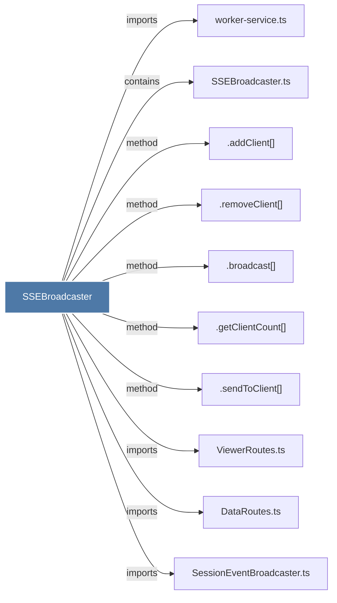

# SSEBroadcaster

> [!info] Properties
> **File Type**: code
> **Community**: [[_COMMUNITY_Community None|Community None]]
> **Degree**: 10

## Architecture Graph


## Outbound Connections
- [[.addClient()]] - `method` [EXTRACTED]
- [[.broadcast()]] - `method` [EXTRACTED]
- [[.getClientCount()]] - `method` [EXTRACTED]
- [[.removeClient()]] - `method` [EXTRACTED]
- [[.sendToClient()]] - `method` [EXTRACTED]
- [[DataRoutes.ts]] - `imports` [EXTRACTED]
- [[SSEBroadcaster.ts]] - `contains` [EXTRACTED]
- [[SessionEventBroadcaster.ts]] - `imports` [EXTRACTED]
- [[ViewerRoutes.ts]] - `imports` [EXTRACTED]
- [[worker-service.ts]] - `imports` [EXTRACTED]

## Inbound Dependencies
> [!abstract]- Files that link here
```dataview
LIST
FROM [[SSEBroadcaster]]
```

#graphify/code #graphify/EXTRACTED #community/Community_None