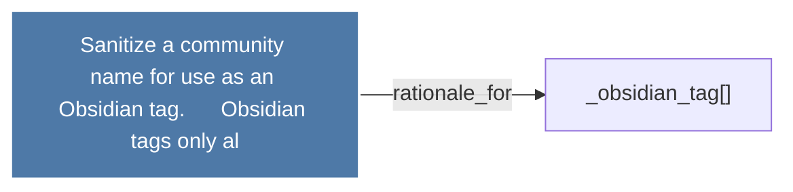

# Sanitize a community name for use as an Obsidian tag.      Obsidian tags only al

> [!info] Properties
> **File Type**: rationale
> **Community**: [[_COMMUNITY_Community None|Community None]]
> **Degree**: 1

## Architecture Graph


## Outbound Connections
- [[_obsidian_tag()]] - `rationale_for` [EXTRACTED]

## Inbound Dependencies
> [!abstract]- Files that link here
```dataview
LIST
FROM [[Sanitize a community name for use as an Obsidian tag.      Obsidian tags only al]]
```

#graphify/rationale #graphify/EXTRACTED #community/Community_None