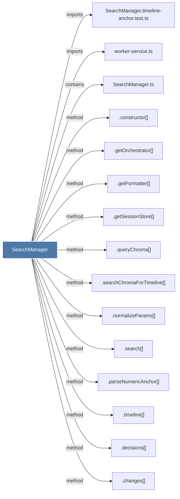

# SearchManager

> [!info] Properties
> **File Type**: code
> **Community**: [[_COMMUNITY_Community None|Community None]]
> **Degree**: 23

## Architecture Graph


## Outbound Connections
- [[.changes()]] - `method` [EXTRACTED]
- [[.constructor()_6]] - `method` [EXTRACTED]
- [[.decisions()]] - `method` [EXTRACTED]
- [[.getContextTimeline()]] - `method` [EXTRACTED]
- [[.getFormatter()]] - `method` [EXTRACTED]
- [[.getOrchestrator()]] - `method` [EXTRACTED]
- [[.getRecentContext()]] - `method` [EXTRACTED]
- [[.getSessionStore()]] - `method` [EXTRACTED]
- [[.getTimelineByQuery()]] - `method` [EXTRACTED]
- [[.howItWorks()]] - `method` [EXTRACTED]
- [[.normalizeParams()]] - `method` [EXTRACTED]
- [[.parseNumericAnchor()]] - `method` [EXTRACTED]
- [[.queryChroma()]] - `method` [EXTRACTED]
- [[.search()]] - `method` [EXTRACTED]
- [[.searchChromaForTimeline()]] - `method` [EXTRACTED]
- [[.searchObservations()]] - `method` [EXTRACTED]
- [[.searchSessions()]] - `method` [EXTRACTED]
- [[.searchUserPrompts()]] - `method` [EXTRACTED]
- [[.timeline()]] - `method` [EXTRACTED]
- [[SearchManager.timeline-anchor.test.ts]] - `imports` [EXTRACTED]
- [[SearchManager.ts]] - `contains` [EXTRACTED]
- [[SearchRoutes.ts]] - `imports` [EXTRACTED]
- [[worker-service.ts]] - `imports` [EXTRACTED]

## Inbound Dependencies
> [!abstract]- Files that link here
```dataview
LIST
FROM [[SearchManager]]
```

#graphify/code #graphify/EXTRACTED #community/Community_None