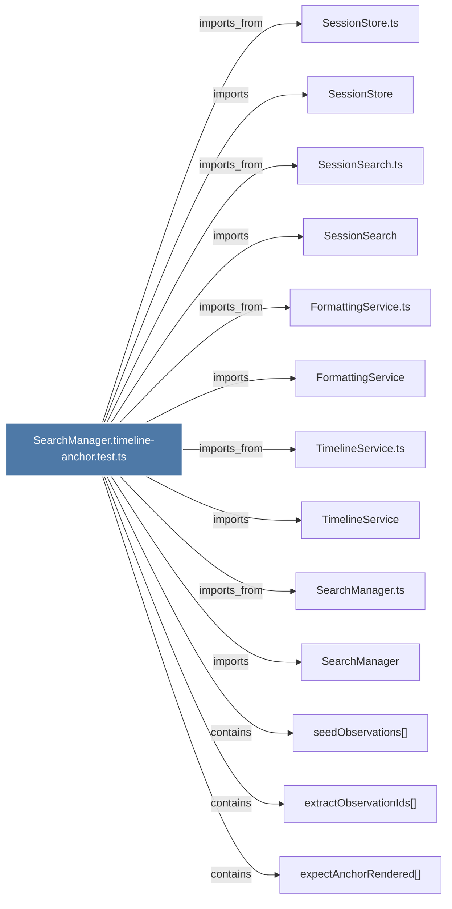

# SearchManager.timeline-anchor.test.ts

> [!info] Properties
> **File Type**: code
> **Community**: [[_COMMUNITY_Community None|Community None]]
> **Degree**: 13

## Architecture Graph


## Outbound Connections
- [[FormattingService]] - `imports` [EXTRACTED]
- [[FormattingService.ts]] - `imports_from` [EXTRACTED]
- [[SearchManager]] - `imports` [EXTRACTED]
- [[SearchManager.ts]] - `imports_from` [EXTRACTED]
- [[SessionSearch]] - `imports` [EXTRACTED]
- [[SessionSearch.ts]] - `imports_from` [EXTRACTED]
- [[SessionStore]] - `imports` [EXTRACTED]
- [[SessionStore.ts]] - `imports_from` [EXTRACTED]
- [[TimelineService]] - `imports` [EXTRACTED]
- [[TimelineService.ts]] - `imports_from` [EXTRACTED]
- [[expectAnchorRendered()]] - `contains` [EXTRACTED]
- [[extractObservationIds()]] - `contains` [EXTRACTED]
- [[seedObservations()]] - `contains` [EXTRACTED]

## Inbound Dependencies
> [!abstract]- Files that link here
```dataview
LIST
FROM [[SearchManager.timeline-anchor.test.ts]]
```

#graphify/code #graphify/EXTRACTED #community/Community_None