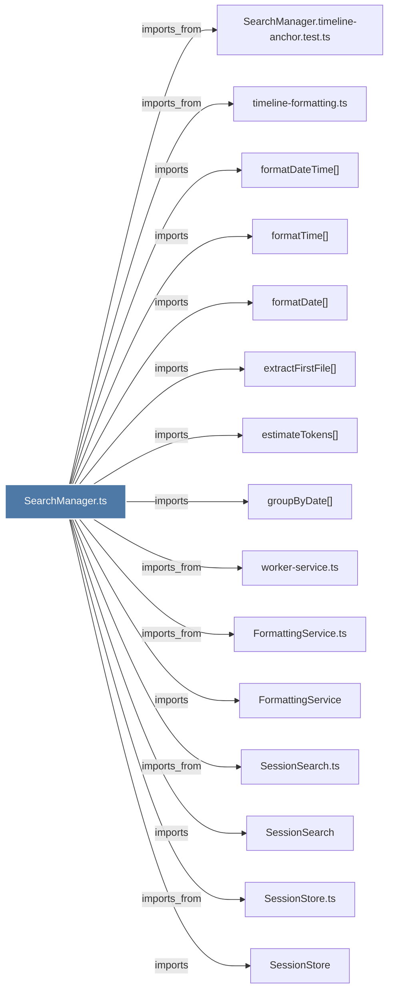

# SearchManager.ts

> [!info] Properties
> **File Type**: code
> **Community**: [[_COMMUNITY_Community None|Community None]]
> **Degree**: 33

## Architecture Graph


## Outbound Connections
- [[ChromaSync]] - `imports` [EXTRACTED]
- [[ChromaSync.ts]] - `imports_from` [EXTRACTED]
- [[ChromaUnavailableError]] - `imports` [EXTRACTED]
- [[FormattingService]] - `imports` [EXTRACTED]
- [[FormattingService.ts]] - `imports_from` [EXTRACTED]
- [[Logger]] - `imports` [EXTRACTED]
- [[ModeManager]] - `imports` [EXTRACTED]
- [[ModeManager.ts]] - `imports_from` [EXTRACTED]
- [[ResultFormatter]] - `imports` [EXTRACTED]
- [[ResultFormatter.ts]] - `imports_from` [EXTRACTED]
- [[SearchManager]] - `contains` [EXTRACTED]
- [[SearchManager.timeline-anchor.test.ts]] - `imports_from` [EXTRACTED]
- [[SearchRoutes.ts]] - `imports_from` [EXTRACTED]
- [[SessionSearch]] - `imports` [EXTRACTED]
- [[SessionSearch.ts]] - `imports_from` [EXTRACTED]
- [[SessionStore]] - `imports` [EXTRACTED]
- [[SessionStore.ts]] - `imports_from` [EXTRACTED]
- [[TimelineService]] - `imports` [EXTRACTED]
- [[TimelineService.ts]] - `imports_from` [EXTRACTED]
- [[errors.ts_1]] - `imports_from` [EXTRACTED]
- [[estimateTokens()_1]] - `imports` [EXTRACTED]
- [[extractFirstFile()]] - `imports` [EXTRACTED]
- [[formatDate()_1]] - `imports` [EXTRACTED]
- [[formatDateTime()]] - `imports` [EXTRACTED]
- [[formatTime()_1]] - `imports` [EXTRACTED]
- [[getProjectContext()]] - `imports` [EXTRACTED]
- [[groupByDate()]] - `imports` [EXTRACTED]
- [[index.ts_5]] - `imports_from` [EXTRACTED]
- [[logger.ts]] - `imports_from` [EXTRACTED]
- [[project-name.ts]] - `imports_from` [EXTRACTED]
- [[timeline-formatting.ts]] - `imports_from` [EXTRACTED]
- [[types.ts_6]] - `imports_from` [EXTRACTED]
- [[worker-service.ts]] - `imports_from` [EXTRACTED]

## Inbound Dependencies
> [!abstract]- Files that link here
```dataview
LIST
FROM [[SearchManager.ts]]
```

#graphify/code #graphify/EXTRACTED #community/Community_None