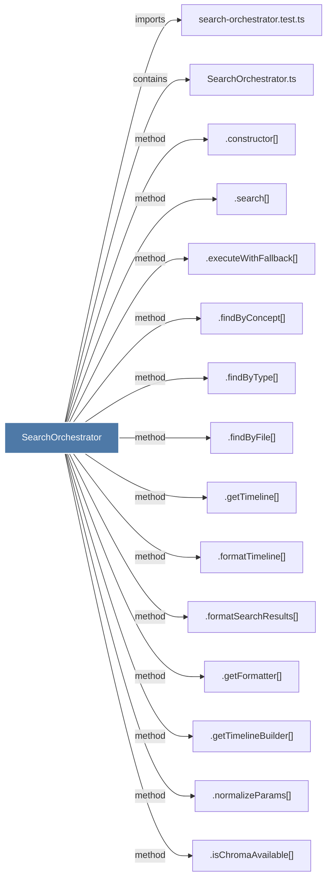

# SearchOrchestrator

> [!info] Properties
> **File Type**: code
> **Community**: [[_COMMUNITY_Community None|Community None]]
> **Degree**: 16

## Architecture Graph


## Outbound Connections
- [[.constructor()_14]] - `method` [EXTRACTED]
- [[.executeWithFallback()]] - `method` [EXTRACTED]
- [[.findByConcept()]] - `method` [EXTRACTED]
- [[.findByFile()]] - `method` [EXTRACTED]
- [[.findByType()]] - `method` [EXTRACTED]
- [[.formatSearchResults()_1]] - `method` [EXTRACTED]
- [[.formatTimeline()_1]] - `method` [EXTRACTED]
- [[.getFormatter()_1]] - `method` [EXTRACTED]
- [[.getTimeline()]] - `method` [EXTRACTED]
- [[.getTimelineBuilder()]] - `method` [EXTRACTED]
- [[.isChromaAvailable()]] - `method` [EXTRACTED]
- [[.normalizeParams()_1]] - `method` [EXTRACTED]
- [[.search()_1]] - `method` [EXTRACTED]
- [[CorpusBuilder.ts]] - `imports` [EXTRACTED]
- [[SearchOrchestrator.ts]] - `contains` [EXTRACTED]
- [[search-orchestrator.test.ts]] - `imports` [EXTRACTED]

## Inbound Dependencies
> [!abstract]- Files that link here
```dataview
LIST
FROM [[SearchOrchestrator]]
```

#graphify/code #graphify/EXTRACTED #community/Community_None