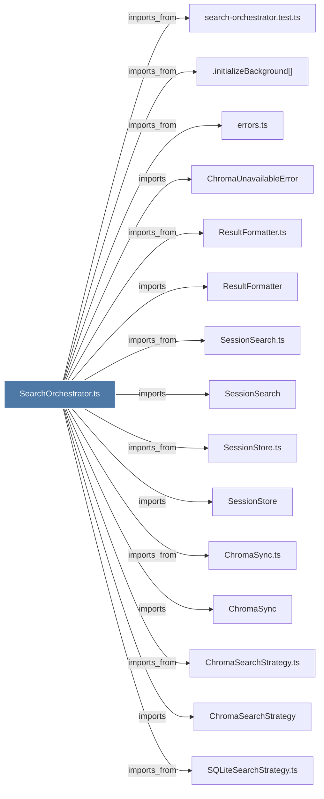

# SearchOrchestrator.ts

> [!info] Properties
> **File Type**: code
> **Community**: [[_COMMUNITY_Community None|Community None]]
> **Degree**: 25

## Architecture Graph


## Outbound Connections
- [[.initializeBackground()]] - `imports_from` [EXTRACTED]
- [[ChromaSearchStrategy]] - `imports` [EXTRACTED]
- [[ChromaSearchStrategy.ts]] - `imports_from` [EXTRACTED]
- [[ChromaSync]] - `imports` [EXTRACTED]
- [[ChromaSync.ts]] - `imports_from` [EXTRACTED]
- [[ChromaUnavailableError]] - `imports` [EXTRACTED]
- [[CorpusBuilder.ts]] - `imports_from` [EXTRACTED]
- [[HybridSearchStrategy]] - `imports` [EXTRACTED]
- [[HybridSearchStrategy.ts]] - `imports_from` [EXTRACTED]
- [[Logger]] - `imports` [EXTRACTED]
- [[ResultFormatter]] - `imports` [EXTRACTED]
- [[ResultFormatter.ts]] - `imports_from` [EXTRACTED]
- [[SQLiteSearchStrategy]] - `imports` [EXTRACTED]
- [[SQLiteSearchStrategy.ts]] - `imports_from` [EXTRACTED]
- [[SearchOrchestrator]] - `contains` [EXTRACTED]
- [[SessionSearch]] - `imports` [EXTRACTED]
- [[SessionSearch.ts]] - `imports_from` [EXTRACTED]
- [[SessionStore]] - `imports` [EXTRACTED]
- [[SessionStore.ts]] - `imports_from` [EXTRACTED]
- [[TimelineBuilder]] - `imports` [EXTRACTED]
- [[TimelineBuilder.ts]] - `imports_from` [EXTRACTED]
- [[errors.ts_1]] - `imports_from` [EXTRACTED]
- [[logger.ts]] - `imports_from` [EXTRACTED]
- [[search-orchestrator.test.ts]] - `imports_from` [EXTRACTED]
- [[types.ts_2]] - `imports_from` [EXTRACTED]

## Inbound Dependencies
> [!abstract]- Files that link here
```dataview
LIST
FROM [[SearchOrchestrator.ts]]
```

#graphify/code #graphify/EXTRACTED #community/Community_None