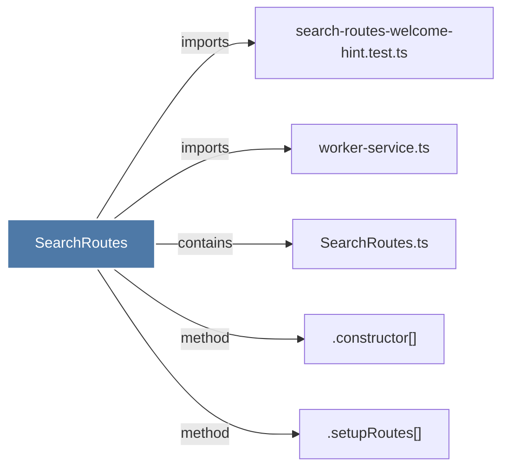

# SearchRoutes

> [!info] Properties
> **File Type**: code
> **Community**: [[_COMMUNITY_Community None|Community None]]
> **Degree**: 5

## Architecture Graph


## Outbound Connections
- [[.constructor()_25]] - `method` [EXTRACTED]
- [[.setupRoutes()_8]] - `method` [EXTRACTED]
- [[SearchRoutes.ts]] - `contains` [EXTRACTED]
- [[search-routes-welcome-hint.test.ts]] - `imports` [EXTRACTED]
- [[worker-service.ts]] - `imports` [EXTRACTED]

## Inbound Dependencies
> [!abstract]- Files that link here
```dataview
LIST
FROM [[SearchRoutes]]
```

#graphify/code #graphify/EXTRACTED #community/Community_None