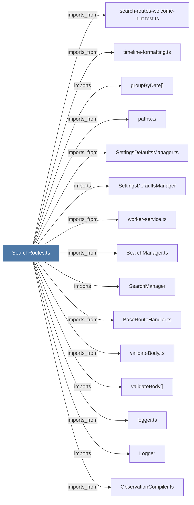

# SearchRoutes.ts

> [!info] Properties
> **File Type**: code
> **Community**: [[_COMMUNITY_Community None|Community None]]
> **Degree**: 20

## Architecture Graph


## Outbound Connections
- [[BaseRouteHandler.ts]] - `imports_from` [EXTRACTED]
- [[Logger]] - `imports` [EXTRACTED]
- [[ObservationCompiler.ts]] - `imports_from` [EXTRACTED]
- [[SearchManager]] - `imports` [EXTRACTED]
- [[SearchManager.ts]] - `imports_from` [EXTRACTED]
- [[SearchRoutes]] - `contains` [EXTRACTED]
- [[SettingsDefaultsManager]] - `imports` [EXTRACTED]
- [[SettingsDefaultsManager.ts]] - `imports_from` [EXTRACTED]
- [[countObservationsByProjects()]] - `imports` [EXTRACTED]
- [[getCachedSettings()]] - `contains` [EXTRACTED]
- [[groupByDate()]] - `imports` [EXTRACTED]
- [[logger.ts]] - `imports_from` [EXTRACTED]
- [[paths.ts]] - `imports_from` [EXTRACTED]
- [[projectsHaveObservations()]] - `contains` [EXTRACTED]
- [[search-routes-welcome-hint.test.ts]] - `imports_from` [EXTRACTED]
- [[timeline-formatting.ts]] - `imports_from` [EXTRACTED]
- [[types.ts_6]] - `imports_from` [EXTRACTED]
- [[validateBody()]] - `imports` [EXTRACTED]
- [[validateBody.ts]] - `imports_from` [EXTRACTED]
- [[worker-service.ts]] - `imports_from` [EXTRACTED]

## Inbound Dependencies
> [!abstract]- Files that link here
```dataview
LIST
FROM [[SearchRoutes.ts]]
```

#graphify/code #graphify/EXTRACTED #community/Community_None