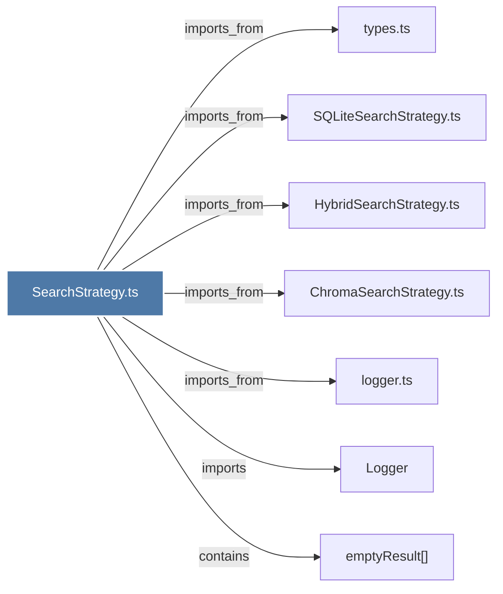

# SearchStrategy.ts

> [!info] Properties
> **File Type**: code
> **Community**: [[_COMMUNITY_Community None|Community None]]
> **Degree**: 7

## Architecture Graph


## Outbound Connections
- [[ChromaSearchStrategy.ts]] - `imports_from` [EXTRACTED]
- [[HybridSearchStrategy.ts]] - `imports_from` [EXTRACTED]
- [[Logger]] - `imports` [EXTRACTED]
- [[SQLiteSearchStrategy.ts]] - `imports_from` [EXTRACTED]
- [[emptyResult()]] - `contains` [EXTRACTED]
- [[logger.ts]] - `imports_from` [EXTRACTED]
- [[types.ts_2]] - `imports_from` [EXTRACTED]

## Inbound Dependencies
> [!abstract]- Files that link here
```dataview
LIST
FROM [[SearchStrategy.ts]]
```

#graphify/code #graphify/EXTRACTED #community/Community_None