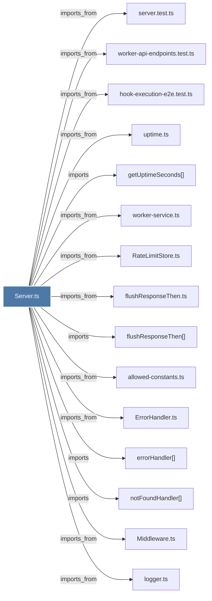

# Server.ts

> [!info] Properties
> **File Type**: code
> **Community**: [[_COMMUNITY_Community None|Community None]]
> **Degree**: 22

## Architecture Graph


## Outbound Connections
- [[ErrorHandler.ts]] - `imports_from` [EXTRACTED]
- [[Logger]] - `imports` [EXTRACTED]
- [[Middleware.ts]] - `imports_from` [EXTRACTED]
- [[RateLimitStore.ts]] - `imports_from` [EXTRACTED]
- [[Server_1]] - `contains` [EXTRACTED]
- [[allowed-constants.ts]] - `imports_from` [EXTRACTED]
- [[env-sanitizer.ts]] - `imports_from` [EXTRACTED]
- [[errorHandler()]] - `imports` [EXTRACTED]
- [[flushResponseThen()]] - `imports` [EXTRACTED]
- [[flushResponseThen.ts]] - `imports_from` [EXTRACTED]
- [[getSupervisor()]] - `imports` [EXTRACTED]
- [[getUptimeSeconds()]] - `imports` [EXTRACTED]
- [[hook-execution-e2e.test.ts]] - `imports_from` [EXTRACTED]
- [[index.ts_11]] - `imports_from` [EXTRACTED]
- [[isPidAlive()]] - `imports` [EXTRACTED]
- [[logger.ts]] - `imports_from` [EXTRACTED]
- [[notFoundHandler()]] - `imports` [EXTRACTED]
- [[process-registry.ts]] - `imports_from` [EXTRACTED]
- [[server.test.ts]] - `imports_from` [EXTRACTED]
- [[uptime.ts]] - `imports_from` [EXTRACTED]
- [[worker-api-endpoints.test.ts]] - `imports_from` [EXTRACTED]
- [[worker-service.ts]] - `imports_from` [EXTRACTED]

## Inbound Dependencies
> [!abstract]- Files that link here
```dataview
LIST
FROM [[Server.ts]]
```

#graphify/code #graphify/EXTRACTED #community/Community_None