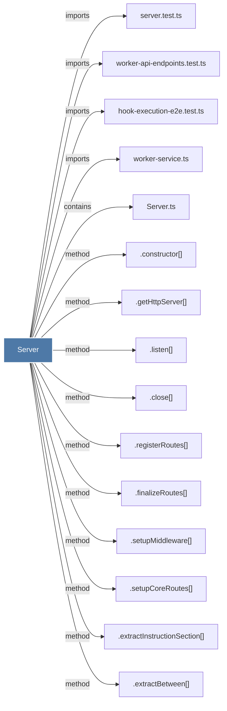

# Server

> [!info] Properties
> **File Type**: code
> **Community**: [[_COMMUNITY_Community None|Community None]]
> **Degree**: 15

## Architecture Graph


## Outbound Connections
- [[.close()_11]] - `method` [EXTRACTED]
- [[.constructor()_41]] - `method` [EXTRACTED]
- [[.extractBetween()]] - `method` [EXTRACTED]
- [[.extractInstructionSection()]] - `method` [EXTRACTED]
- [[.finalizeRoutes()]] - `method` [EXTRACTED]
- [[.getHttpServer()]] - `method` [EXTRACTED]
- [[.listen()]] - `method` [EXTRACTED]
- [[.registerRoutes()_1]] - `method` [EXTRACTED]
- [[.setupCoreRoutes()]] - `method` [EXTRACTED]
- [[.setupMiddleware()]] - `method` [EXTRACTED]
- [[Server.ts]] - `contains` [EXTRACTED]
- [[hook-execution-e2e.test.ts]] - `imports` [EXTRACTED]
- [[server.test.ts]] - `imports` [EXTRACTED]
- [[worker-api-endpoints.test.ts]] - `imports` [EXTRACTED]
- [[worker-service.ts]] - `imports` [EXTRACTED]

## Inbound Dependencies
> [!abstract]- Files that link here
```dataview
LIST
FROM [[Server_1]]
```

#graphify/code #graphify/EXTRACTED #community/Community_None