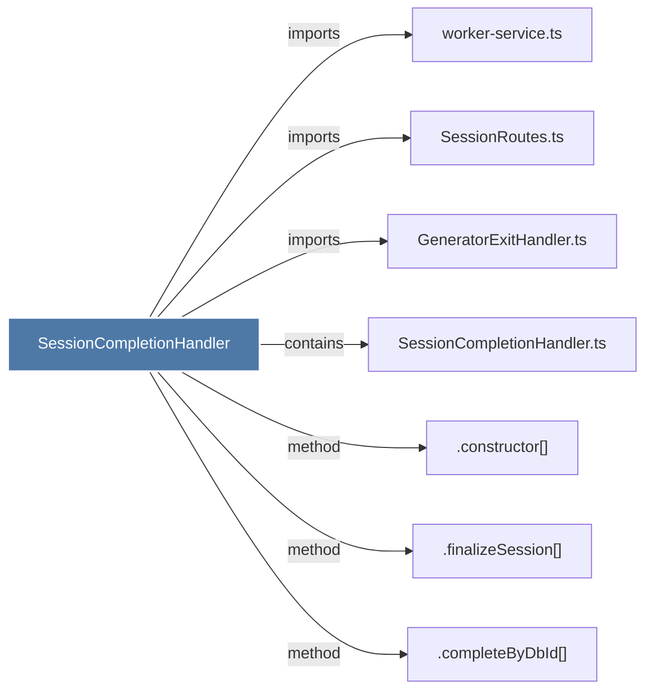

# SessionCompletionHandler

> [!info] Properties
> **File Type**: code
> **Community**: [[_COMMUNITY_Community None|Community None]]
> **Degree**: 7

## Architecture Graph


## Outbound Connections
- [[.completeByDbId()]] - `method` [EXTRACTED]
- [[.constructor()_30]] - `method` [EXTRACTED]
- [[.finalizeSession()]] - `method` [EXTRACTED]
- [[GeneratorExitHandler.ts]] - `imports` [EXTRACTED]
- [[SessionCompletionHandler.ts]] - `contains` [EXTRACTED]
- [[SessionRoutes.ts]] - `imports` [EXTRACTED]
- [[worker-service.ts]] - `imports` [EXTRACTED]

## Inbound Dependencies
> [!abstract]- Files that link here
```dataview
LIST
FROM [[SessionCompletionHandler]]
```

#graphify/code #graphify/EXTRACTED #community/Community_None