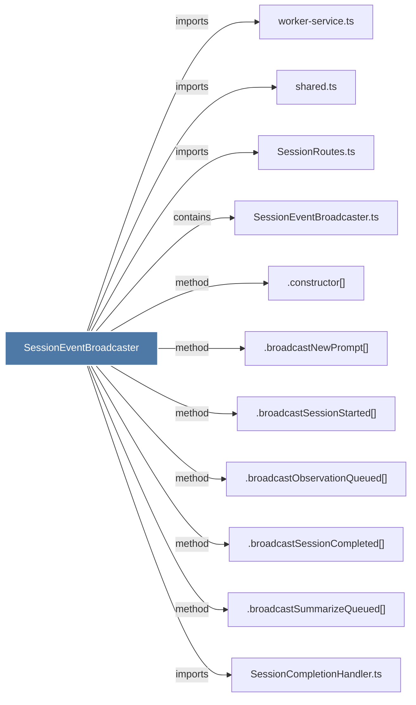

# SessionEventBroadcaster

> [!info] Properties
> **File Type**: code
> **Community**: [[_COMMUNITY_Community None|Community None]]
> **Degree**: 11

## Architecture Graph


## Outbound Connections
- [[.broadcastNewPrompt()]] - `method` [EXTRACTED]
- [[.broadcastObservationQueued()]] - `method` [EXTRACTED]
- [[.broadcastSessionCompleted()]] - `method` [EXTRACTED]
- [[.broadcastSessionStarted()]] - `method` [EXTRACTED]
- [[.broadcastSummarizeQueued()]] - `method` [EXTRACTED]
- [[.constructor()_26]] - `method` [EXTRACTED]
- [[SessionCompletionHandler.ts]] - `imports` [EXTRACTED]
- [[SessionEventBroadcaster.ts]] - `contains` [EXTRACTED]
- [[SessionRoutes.ts]] - `imports` [EXTRACTED]
- [[shared.ts]] - `imports` [EXTRACTED]
- [[worker-service.ts]] - `imports` [EXTRACTED]

## Inbound Dependencies
> [!abstract]- Files that link here
```dataview
LIST
FROM [[SessionEventBroadcaster]]
```

#graphify/code #graphify/EXTRACTED #community/Community_None