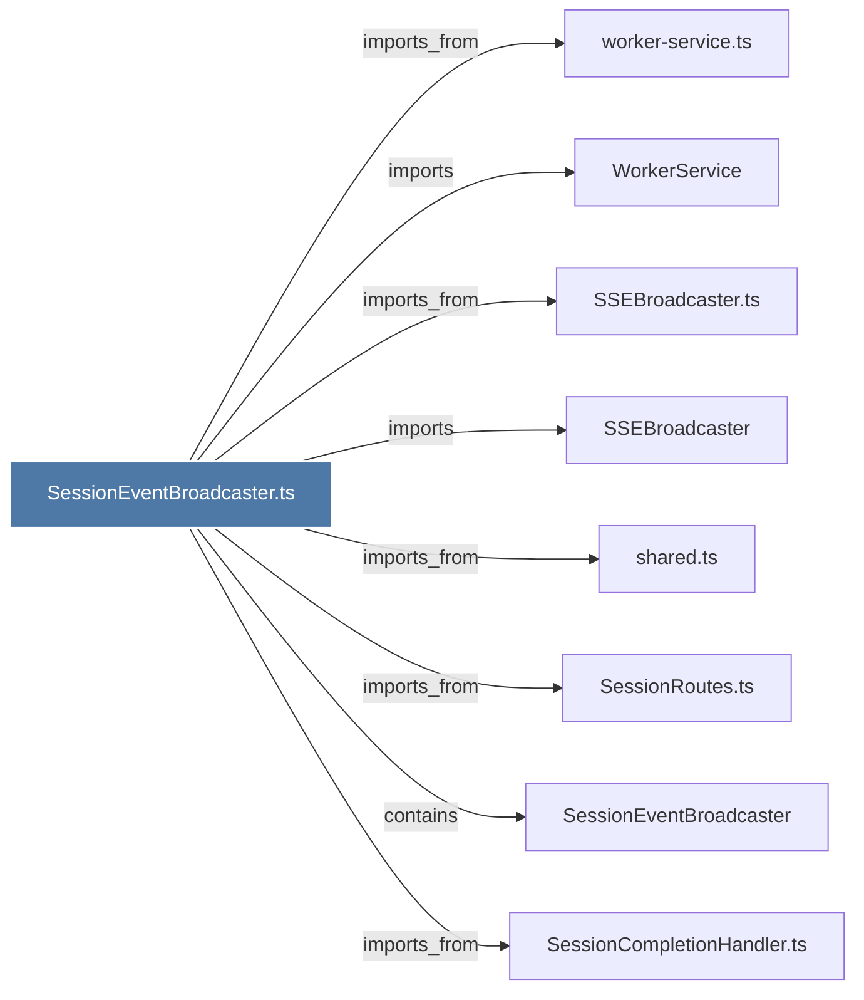

# SessionEventBroadcaster.ts

> [!info] Properties
> **File Type**: code
> **Community**: [[_COMMUNITY_Community None|Community None]]
> **Degree**: 8

## Architecture Graph


## Outbound Connections
- [[SSEBroadcaster]] - `imports` [EXTRACTED]
- [[SSEBroadcaster.ts]] - `imports_from` [EXTRACTED]
- [[SessionCompletionHandler.ts]] - `imports_from` [EXTRACTED]
- [[SessionEventBroadcaster]] - `contains` [EXTRACTED]
- [[SessionRoutes.ts]] - `imports_from` [EXTRACTED]
- [[WorkerService]] - `imports` [EXTRACTED]
- [[shared.ts]] - `imports_from` [EXTRACTED]
- [[worker-service.ts]] - `imports_from` [EXTRACTED]

## Inbound Dependencies
> [!abstract]- Files that link here
```dataview
LIST
FROM [[SessionEventBroadcaster.ts]]
```

#graphify/code #graphify/EXTRACTED #community/Community_None