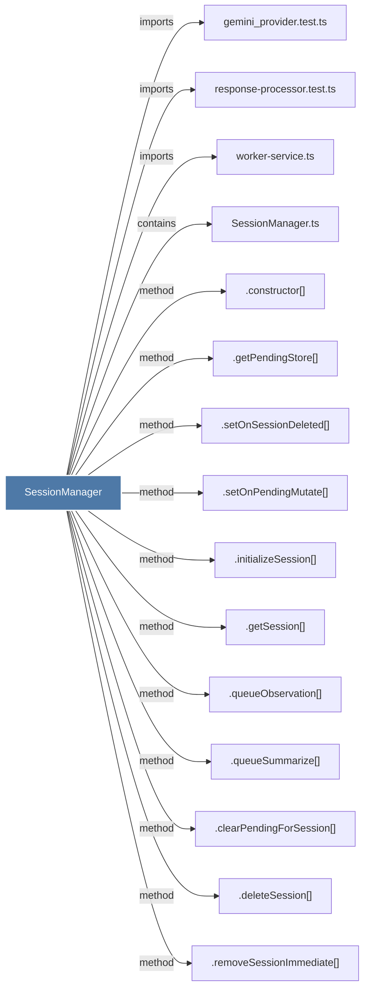

# SessionManager

> [!info] Properties
> **File Type**: code
> **Community**: [[_COMMUNITY_Community None|Community None]]
> **Degree**: 33

## Architecture Graph


## Outbound Connections
- [[.clearPendingForSession()]] - `method` [EXTRACTED]
- [[.constructor()_5]] - `method` [EXTRACTED]
- [[.deleteSession()]] - `method` [EXTRACTED]
- [[.getActiveSessionCount()]] - `method` [EXTRACTED]
- [[.getMessageIterator()]] - `method` [EXTRACTED]
- [[.getPendingMessageStore()]] - `method` [EXTRACTED]
- [[.getPendingStore()]] - `method` [EXTRACTED]
- [[.getSession()]] - `method` [EXTRACTED]
- [[.getTotalActiveWork()]] - `method` [EXTRACTED]
- [[.getTotalQueueDepth()]] - `method` [EXTRACTED]
- [[.hasPendingMessages()]] - `method` [EXTRACTED]
- [[.initializeSession()]] - `method` [EXTRACTED]
- [[.isAnySessionProcessing()]] - `method` [EXTRACTED]
- [[.queueObservation()]] - `method` [EXTRACTED]
- [[.queueSummarize()]] - `method` [EXTRACTED]
- [[.removeSessionImmediate()]] - `method` [EXTRACTED]
- [[.setOnPendingMutate()]] - `method` [EXTRACTED]
- [[.setOnSessionDeleted()]] - `method` [EXTRACTED]
- [[.shutdownAll()]] - `method` [EXTRACTED]
- [[ClaudeProvider.ts]] - `imports` [EXTRACTED]
- [[DataRoutes.ts]] - `imports` [EXTRACTED]
- [[GeminiProvider.ts]] - `imports` [EXTRACTED]
- [[GeneratorExitHandler.ts]] - `imports` [EXTRACTED]
- [[OpenRouterProvider.ts]] - `imports` [EXTRACTED]
- [[ResponseProcessor.ts]] - `imports` [EXTRACTED]
- [[SessionCompletionHandler.ts]] - `imports` [EXTRACTED]
- [[SessionManager.ts]] - `contains` [EXTRACTED]
- [[SessionRoutes.ts]] - `imports` [EXTRACTED]
- [[ViewerRoutes.ts]] - `imports` [EXTRACTED]
- [[gemini_provider.test.ts]] - `imports` [EXTRACTED]
- [[response-processor.test.ts]] - `imports` [EXTRACTED]
- [[shared.ts]] - `imports` [EXTRACTED]
- [[worker-service.ts]] - `imports` [EXTRACTED]

## Inbound Dependencies
> [!abstract]- Files that link here
```dataview
LIST
FROM [[SessionManager]]
```

#graphify/code #graphify/EXTRACTED #community/Community_None