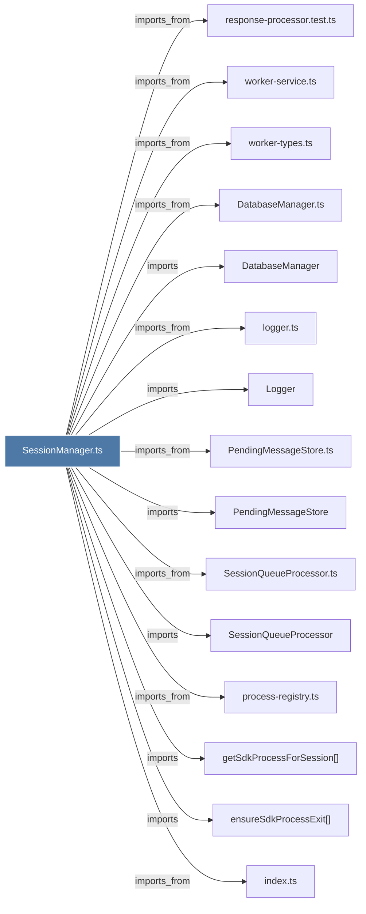

# SessionManager.ts

> [!info] Properties
> **File Type**: code
> **Community**: [[_COMMUNITY_Community None|Community None]]
> **Degree**: 29

## Architecture Graph


## Outbound Connections
- [[ClaudeProvider.ts]] - `imports_from` [EXTRACTED]
- [[DataRoutes.ts]] - `imports_from` [EXTRACTED]
- [[DatabaseManager]] - `imports` [EXTRACTED]
- [[DatabaseManager.ts]] - `imports_from` [EXTRACTED]
- [[GeminiProvider.ts]] - `imports_from` [EXTRACTED]
- [[GeneratorExitHandler.ts]] - `imports_from` [EXTRACTED]
- [[Logger]] - `imports` [EXTRACTED]
- [[OpenRouterProvider.ts]] - `imports_from` [EXTRACTED]
- [[PendingMessageStore]] - `imports` [EXTRACTED]
- [[PendingMessageStore.ts]] - `imports_from` [EXTRACTED]
- [[ResponseProcessor.ts]] - `imports_from` [EXTRACTED]
- [[RestartGuard]] - `imports` [EXTRACTED]
- [[RestartGuard.ts]] - `imports_from` [EXTRACTED]
- [[SessionCompletionHandler.ts]] - `imports_from` [EXTRACTED]
- [[SessionManager]] - `contains` [EXTRACTED]
- [[SessionQueueProcessor]] - `imports` [EXTRACTED]
- [[SessionQueueProcessor.ts]] - `imports_from` [EXTRACTED]
- [[SessionRoutes.ts]] - `imports_from` [EXTRACTED]
- [[ViewerRoutes.ts]] - `imports_from` [EXTRACTED]
- [[ensureSdkProcessExit()]] - `imports` [EXTRACTED]
- [[getSdkProcessForSession()]] - `imports` [EXTRACTED]
- [[getSupervisor()]] - `imports` [EXTRACTED]
- [[index.ts_11]] - `imports_from` [EXTRACTED]
- [[logger.ts]] - `imports_from` [EXTRACTED]
- [[process-registry.ts]] - `imports_from` [EXTRACTED]
- [[response-processor.test.ts]] - `imports_from` [EXTRACTED]
- [[shared.ts]] - `imports_from` [EXTRACTED]
- [[worker-service.ts]] - `imports_from` [EXTRACTED]
- [[worker-types.ts]] - `imports_from` [EXTRACTED]

## Inbound Dependencies
> [!abstract]- Files that link here
```dataview
LIST
FROM [[SessionManager.ts]]
```

#graphify/code #graphify/EXTRACTED #community/Community_None