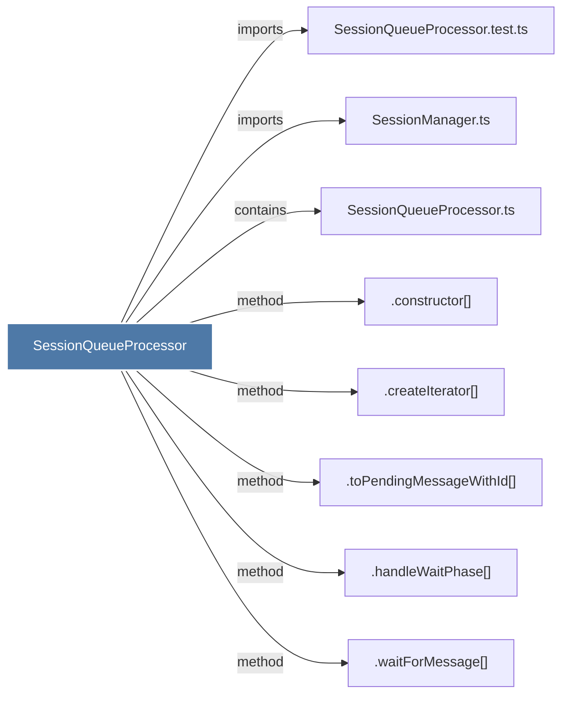

# SessionQueueProcessor

> [!info] Properties
> **File Type**: code
> **Community**: [[_COMMUNITY_Community None|Community None]]
> **Degree**: 8

## Architecture Graph


## Outbound Connections
- [[.constructor()_31]] - `method` [EXTRACTED]
- [[.createIterator()]] - `method` [EXTRACTED]
- [[.handleWaitPhase()]] - `method` [EXTRACTED]
- [[.toPendingMessageWithId()]] - `method` [EXTRACTED]
- [[.waitForMessage()]] - `method` [EXTRACTED]
- [[SessionManager.ts]] - `imports` [EXTRACTED]
- [[SessionQueueProcessor.test.ts]] - `imports` [EXTRACTED]
- [[SessionQueueProcessor.ts]] - `contains` [EXTRACTED]

## Inbound Dependencies
> [!abstract]- Files that link here
```dataview
LIST
FROM [[SessionQueueProcessor]]
```

#graphify/code #graphify/EXTRACTED #community/Community_None