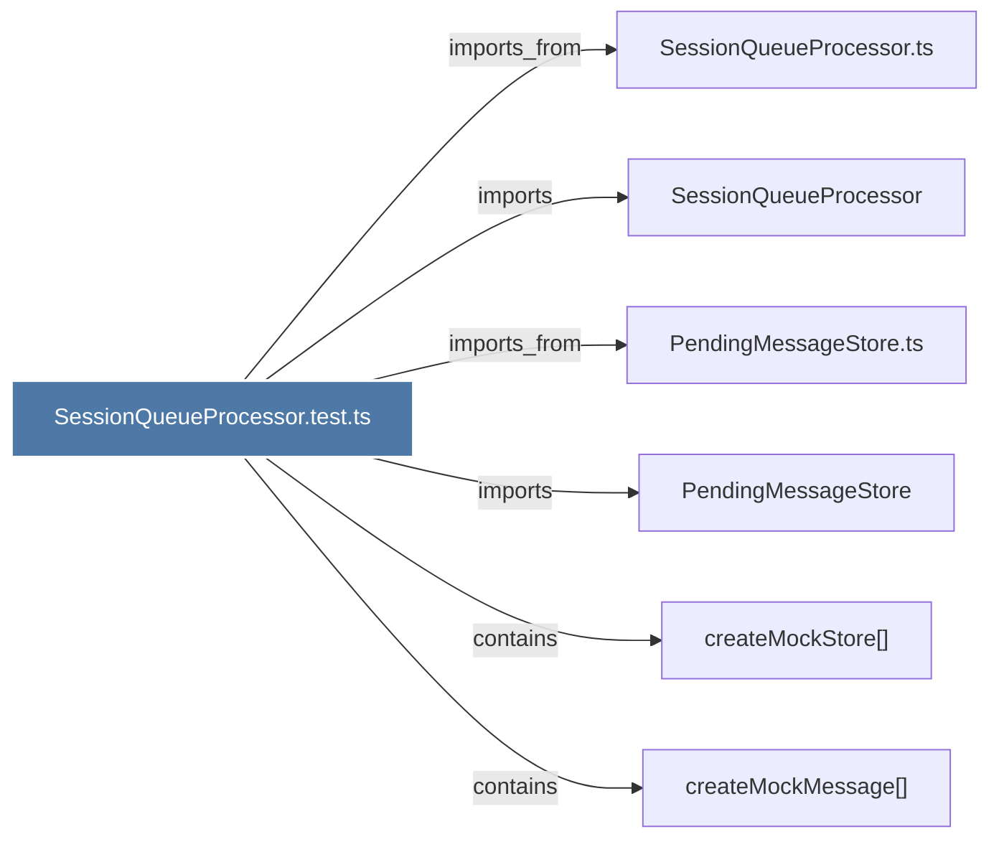

# SessionQueueProcessor.test.ts

> [!info] Properties
> **File Type**: code
> **Community**: [[_COMMUNITY_Community None|Community None]]
> **Degree**: 6

## Architecture Graph


## Outbound Connections
- [[PendingMessageStore]] - `imports` [EXTRACTED]
- [[PendingMessageStore.ts]] - `imports_from` [EXTRACTED]
- [[SessionQueueProcessor]] - `imports` [EXTRACTED]
- [[SessionQueueProcessor.ts]] - `imports_from` [EXTRACTED]
- [[createMockMessage()]] - `contains` [EXTRACTED]
- [[createMockStore()]] - `contains` [EXTRACTED]

## Inbound Dependencies
> [!abstract]- Files that link here
```dataview
LIST
FROM [[SessionQueueProcessor.test.ts]]
```

#graphify/code #graphify/EXTRACTED #community/Community_None