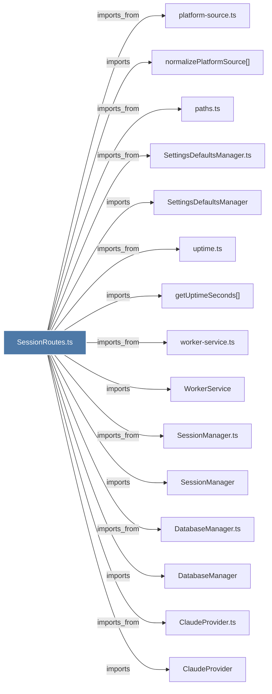

# SessionRoutes.ts

> [!info] Properties
> **File Type**: code
> **Community**: [[_COMMUNITY_Community None|Community None]]
> **Degree**: 44

## Architecture Graph


## Outbound Connections
- [[BaseRouteHandler.ts]] - `imports_from` [EXTRACTED]
- [[ClaudeProvider]] - `imports` [EXTRACTED]
- [[ClaudeProvider.ts]] - `imports_from` [EXTRACTED]
- [[DatabaseManager]] - `imports` [EXTRACTED]
- [[DatabaseManager.ts]] - `imports_from` [EXTRACTED]
- [[GeminiProvider]] - `imports` [EXTRACTED]
- [[GeminiProvider.ts]] - `imports_from` [EXTRACTED]
- [[GeneratorExitHandler.ts]] - `imports_from` [EXTRACTED]
- [[Logger]] - `imports` [EXTRACTED]
- [[OpenRouterProvider]] - `imports` [EXTRACTED]
- [[OpenRouterProvider.ts]] - `imports_from` [EXTRACTED]
- [[PrivacyCheckValidator]] - `imports` [EXTRACTED]
- [[PrivacyCheckValidator.ts]] - `imports_from` [EXTRACTED]
- [[SessionCompletionHandler]] - `imports` [EXTRACTED]
- [[SessionCompletionHandler.ts]] - `imports_from` [EXTRACTED]
- [[SessionEventBroadcaster]] - `imports` [EXTRACTED]
- [[SessionEventBroadcaster.ts]] - `imports_from` [EXTRACTED]
- [[SessionManager]] - `imports` [EXTRACTED]
- [[SessionManager.ts]] - `imports_from` [EXTRACTED]
- [[SessionRoutes]] - `contains` [EXTRACTED]
- [[SettingsDefaultsManager]] - `imports` [EXTRACTED]
- [[SettingsDefaultsManager.ts]] - `imports_from` [EXTRACTED]
- [[WorkerService]] - `imports` [EXTRACTED]
- [[getProjectContext()]] - `imports` [EXTRACTED]
- [[getUptimeSeconds()]] - `imports` [EXTRACTED]
- [[handleGeneratorExit()]] - `imports` [EXTRACTED]
- [[ingestObservation()]] - `imports` [EXTRACTED]
- [[isGeminiAvailable()]] - `imports` [EXTRACTED]
- [[isGeminiSelected()]] - `imports` [EXTRACTED]
- [[isInternalProtocolPayload()]] - `imports` [EXTRACTED]
- [[isOpenRouterAvailable()]] - `imports` [EXTRACTED]
- [[isOpenRouterSelected()]] - `imports` [EXTRACTED]
- [[logger.ts]] - `imports_from` [EXTRACTED]
- [[normalizePlatformSource()]] - `imports` [EXTRACTED]
- [[paths.ts]] - `imports_from` [EXTRACTED]
- [[platform-source.ts]] - `imports_from` [EXTRACTED]
- [[project-name.ts]] - `imports_from` [EXTRACTED]
- [[shared.ts]] - `imports_from` [EXTRACTED]
- [[stripMemoryTagsFromPrompt()]] - `imports` [EXTRACTED]
- [[tag-stripping.ts]] - `imports_from` [EXTRACTED]
- [[uptime.ts]] - `imports_from` [EXTRACTED]
- [[validateBody()]] - `imports` [EXTRACTED]
- [[validateBody.ts]] - `imports_from` [EXTRACTED]
- [[worker-service.ts]] - `imports_from` [EXTRACTED]

## Inbound Dependencies
> [!abstract]- Files that link here
```dataview
LIST
FROM [[SessionRoutes.ts]]
```

#graphify/code #graphify/EXTRACTED #community/Community_None