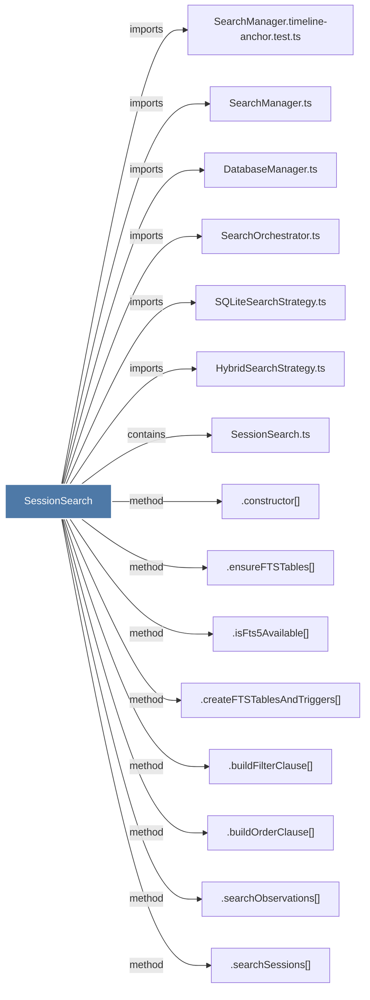

# SessionSearch

> [!info] Properties
> **File Type**: code
> **Community**: [[_COMMUNITY_Community None|Community None]]
> **Degree**: 23

## Architecture Graph


## Outbound Connections
- [[.buildFilterClause()]] - `method` [EXTRACTED]
- [[.buildOrderClause()]] - `method` [EXTRACTED]
- [[.close()_10]] - `method` [EXTRACTED]
- [[.constructor()_38]] - `method` [EXTRACTED]
- [[.createFTSTablesAndTriggers()]] - `method` [EXTRACTED]
- [[.ensureFTSTables()]] - `method` [EXTRACTED]
- [[.findByConcept()_3]] - `method` [EXTRACTED]
- [[.findByFile()_3]] - `method` [EXTRACTED]
- [[.findByType()_3]] - `method` [EXTRACTED]
- [[.getUserPromptsBySession()]] - `method` [EXTRACTED]
- [[.hasDirectChildFile()]] - `method` [EXTRACTED]
- [[.hasDirectChildFileSession()]] - `method` [EXTRACTED]
- [[.isFts5Available()]] - `method` [EXTRACTED]
- [[.searchObservations()_1]] - `method` [EXTRACTED]
- [[.searchSessions()_1]] - `method` [EXTRACTED]
- [[.searchUserPrompts()_1]] - `method` [EXTRACTED]
- [[DatabaseManager.ts]] - `imports` [EXTRACTED]
- [[HybridSearchStrategy.ts]] - `imports` [EXTRACTED]
- [[SQLiteSearchStrategy.ts]] - `imports` [EXTRACTED]
- [[SearchManager.timeline-anchor.test.ts]] - `imports` [EXTRACTED]
- [[SearchManager.ts]] - `imports` [EXTRACTED]
- [[SearchOrchestrator.ts]] - `imports` [EXTRACTED]
- [[SessionSearch.ts]] - `contains` [EXTRACTED]

## Inbound Dependencies
> [!abstract]- Files that link here
```dataview
LIST
FROM [[SessionSearch]]
```

#graphify/code #graphify/EXTRACTED #community/Community_None