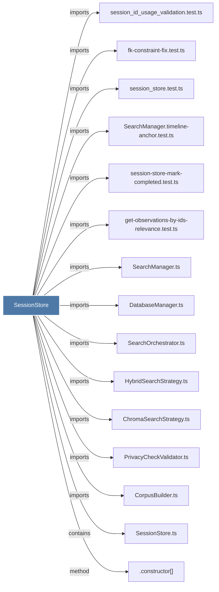

# SessionStore

> [!info] Properties
> **File Type**: code
> **Community**: [[_COMMUNITY_Community None|Community None]]
> **Degree**: 88

## Architecture Graph


## Outbound Connections
- [[.addFailedAtEpochColumn()]] - `method` [EXTRACTED]
- [[.addObservationContentHashColumn()]] - `method` [EXTRACTED]
- [[.addObservationHierarchicalFields()]] - `method` [EXTRACTED]
- [[.addObservationModelColumns()]] - `method` [EXTRACTED]
- [[.addObservationSubagentColumns()]] - `method` [EXTRACTED]
- [[.addObservationsMetadataColumn()]] - `method` [EXTRACTED]
- [[.addObservationsUniqueContentHashIndex()]] - `method` [EXTRACTED]
- [[.addOnUpdateCascadeToForeignKeys()]] - `method` [EXTRACTED]
- [[.addPendingMessagesToolUseIdAndWorkerPidColumns()]] - `method` [EXTRACTED]
- [[.addSessionCustomTitleColumn()]] - `method` [EXTRACTED]
- [[.addSessionPlatformSourceColumn()]] - `method` [EXTRACTED]
- [[.close()_9]] - `method` [EXTRACTED]
- [[.constructor()_36]] - `method` [EXTRACTED]
- [[.createPendingMessagesTable()]] - `method` [EXTRACTED]
- [[.createSDKSession()]] - `method` [EXTRACTED]
- [[.createUserPromptsTable()]] - `method` [EXTRACTED]
- [[.dropDeadPendingMessagesColumns()]] - `method` [EXTRACTED]
- [[.dropWorkerPidColumn()]] - `method` [EXTRACTED]
- [[.ensureDiscoveryTokensColumn()]] - `method` [EXTRACTED]
- [[.ensureMemorySessionIdRegistered()]] - `method` [EXTRACTED]
- [[.ensureMergedIntoProjectColumns()]] - `method` [EXTRACTED]
- [[.ensurePromptTrackingColumns()]] - `method` [EXTRACTED]
- [[.ensureWorkerPortColumn()]] - `method` [EXTRACTED]
- [[.getAllProjects()]] - `method` [EXTRACTED]
- [[.getAllRecentObservations()]] - `method` [EXTRACTED]
- [[.getAllRecentSummaries()]] - `method` [EXTRACTED]
- [[.getAllRecentUserPrompts()]] - `method` [EXTRACTED]
- [[.getFilesForSession()]] - `method` [EXTRACTED]
- [[.getLatestUserPrompt()]] - `method` [EXTRACTED]
- [[.getObservationById()]] - `method` [EXTRACTED]
- [[.getObservationsByIds()]] - `method` [EXTRACTED]
- [[.getObservationsForSession()]] - `method` [EXTRACTED]
- [[.getOrCreateManualSession()]] - `method` [EXTRACTED]
- [[.getProjectCatalog()]] - `method` [EXTRACTED]
- [[.getPromptById()]] - `method` [EXTRACTED]
- [[.getPromptNumberFromUserPrompts()]] - `method` [EXTRACTED]
- [[.getPromptsByIds()]] - `method` [EXTRACTED]
- [[.getRecentObservations()]] - `method` [EXTRACTED]
- [[.getRecentSessionsWithStatus()]] - `method` [EXTRACTED]
- [[.getRecentSummaries()]] - `method` [EXTRACTED]
- [[.getRecentSummariesWithSessionInfo()]] - `method` [EXTRACTED]
- [[.getSdkSessionsBySessionIds()]] - `method` [EXTRACTED]
- [[.getSessionById()_1]] - `method` [EXTRACTED]
- [[.getSessionSummariesByIds()]] - `method` [EXTRACTED]
- [[.getSessionSummaryById()]] - `method` [EXTRACTED]
- [[.getSummaryForSession()]] - `method` [EXTRACTED]
- [[.getTimelineAroundObservation()]] - `method` [EXTRACTED]
- [[.getTimelineAroundTimestamp()]] - `method` [EXTRACTED]
- [[.getUserPrompt()]] - `method` [EXTRACTED]
- [[.getUserPromptsByIds()]] - `method` [EXTRACTED]
- [[.importObservation()]] - `method` [EXTRACTED]
- [[.importSdkSession()]] - `method` [EXTRACTED]
- [[.importSessionSummary()]] - `method` [EXTRACTED]
- [[.importUserPrompt()]] - `method` [EXTRACTED]
- [[.initializeSchema()]] - `method` [EXTRACTED]
- [[.makeObservationsTextNullable()]] - `method` [EXTRACTED]
- [[.markSessionCompleted()]] - `method` [EXTRACTED]
- [[.rebuildObservationsFTSIndex()]] - `method` [EXTRACTED]
- [[.recreateObservationsWithCascade()]] - `method` [EXTRACTED]
- [[.recreateSessionSummariesWithCascade()]] - `method` [EXTRACTED]
- [[.removeSessionSummariesUniqueConstraint()]] - `method` [EXTRACTED]
- [[.renameSessionIdColumns()]] - `method` [EXTRACTED]
- [[.repairSessionIdColumnRename()]] - `method` [EXTRACTED]
- [[.saveUserPrompt()]] - `method` [EXTRACTED]
- [[.storeObservation()]] - `method` [EXTRACTED]
- [[.storeObservations()]] - `method` [EXTRACTED]
- [[.storeObservationsAndMarkComplete()]] - `method` [EXTRACTED]
- [[.storeSummary()]] - `method` [EXTRACTED]
- [[.updateMemorySessionId()]] - `method` [EXTRACTED]
- [[ChromaSearchStrategy.ts]] - `imports` [EXTRACTED]
- [[ChromaSync.ts]] - `imports` [EXTRACTED]
- [[ContextBuilder.ts]] - `imports` [EXTRACTED]
- [[CorpusBuilder.ts]] - `imports` [EXTRACTED]
- [[DatabaseManager.ts]] - `imports` [EXTRACTED]
- [[HybridSearchStrategy.ts]] - `imports` [EXTRACTED]
- [[ObservationCompiler.ts]] - `imports` [EXTRACTED]
- [[PrivacyCheckValidator.ts]] - `imports` [EXTRACTED]
- [[SearchManager.timeline-anchor.test.ts]] - `imports` [EXTRACTED]
- [[SearchManager.ts]] - `imports` [EXTRACTED]
- [[SearchOrchestrator.ts]] - `imports` [EXTRACTED]
- [[SessionStore.ts]] - `contains` [EXTRACTED]
- [[cleanup-duplicates.ts]] - `imports` [EXTRACTED]
- [[fk-constraint-fix.test.ts]] - `imports` [EXTRACTED]
- [[get-observations-by-ids-relevance.test.ts]] - `imports` [EXTRACTED]
- [[import-xml-observations.ts]] - `imports` [EXTRACTED]
- [[session-store-mark-completed.test.ts]] - `imports` [EXTRACTED]
- [[session_id_usage_validation.test.ts]] - `imports` [EXTRACTED]
- [[session_store.test.ts]] - `imports` [EXTRACTED]

## Inbound Dependencies
> [!abstract]- Files that link here
```dataview
LIST
FROM [[SessionStore]]
```

#graphify/code #graphify/EXTRACTED #community/Community_None