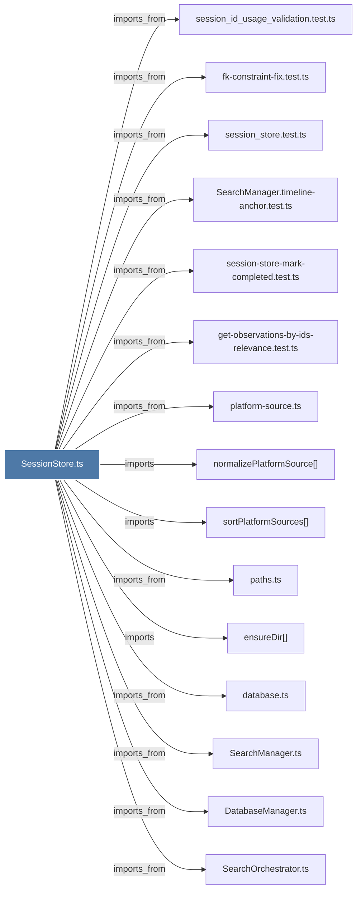

# SessionStore.ts

> [!info] Properties
> **File Type**: code
> **Community**: [[_COMMUNITY_Community None|Community None]]
> **Degree**: 35

## Architecture Graph


## Outbound Connections
- [[ChromaSearchStrategy.ts]] - `imports_from` [EXTRACTED]
- [[ChromaSync.ts]] - `imports_from` [EXTRACTED]
- [[ContextBuilder.ts]] - `imports_from` [EXTRACTED]
- [[CorpusBuilder.ts]] - `imports_from` [EXTRACTED]
- [[DatabaseManager.ts]] - `imports_from` [EXTRACTED]
- [[HybridSearchStrategy.ts]] - `imports_from` [EXTRACTED]
- [[Logger]] - `imports` [EXTRACTED]
- [[ObservationCompiler.ts]] - `imports_from` [EXTRACTED]
- [[PendingMessageStore]] - `imports` [EXTRACTED]
- [[PendingMessageStore.ts]] - `imports_from` [EXTRACTED]
- [[PrivacyCheckValidator.ts]] - `imports_from` [EXTRACTED]
- [[SearchManager.timeline-anchor.test.ts]] - `imports_from` [EXTRACTED]
- [[SearchManager.ts]] - `imports_from` [EXTRACTED]
- [[SearchOrchestrator.ts]] - `imports_from` [EXTRACTED]
- [[SessionStore]] - `contains` [EXTRACTED]
- [[cleanup-duplicates.ts]] - `imports_from` [EXTRACTED]
- [[computeObservationContentHash()]] - `imports` [EXTRACTED]
- [[database.ts]] - `imports_from` [EXTRACTED]
- [[ensureDir()]] - `imports` [EXTRACTED]
- [[files.ts]] - `imports_from` [EXTRACTED]
- [[fk-constraint-fix.test.ts]] - `imports_from` [EXTRACTED]
- [[get-observations-by-ids-relevance.test.ts]] - `imports_from` [EXTRACTED]
- [[import-xml-observations.ts]] - `imports_from` [EXTRACTED]
- [[logger.ts]] - `imports_from` [EXTRACTED]
- [[normalizePlatformSource()]] - `imports` [EXTRACTED]
- [[parseFileList()]] - `imports` [EXTRACTED]
- [[paths.ts]] - `imports_from` [EXTRACTED]
- [[platform-source.ts]] - `imports_from` [EXTRACTED]
- [[resolveCreateSessionArgs()]] - `contains` [EXTRACTED]
- [[session-store-mark-completed.test.ts]] - `imports_from` [EXTRACTED]
- [[session_id_usage_validation.test.ts]] - `imports_from` [EXTRACTED]
- [[session_store.test.ts]] - `imports_from` [EXTRACTED]
- [[sortPlatformSources()]] - `imports` [EXTRACTED]
- [[store.ts]] - `imports_from` [EXTRACTED]
- [[types.ts_6]] - `imports_from` [EXTRACTED]

## Inbound Dependencies
> [!abstract]- Files that link here
```dataview
LIST
FROM [[SessionStore.ts]]
```

#graphify/code #graphify/EXTRACTED #community/Community_None