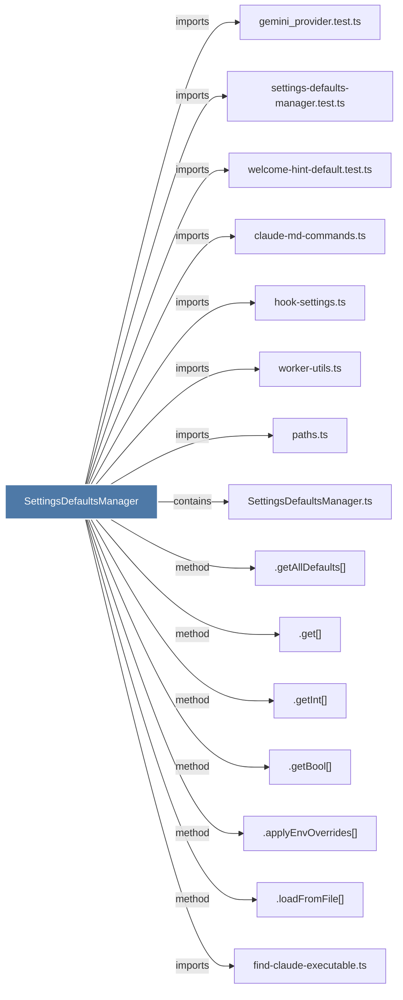

# SettingsDefaultsManager

> [!info] Properties
> **File Type**: code
> **Community**: [[_COMMUNITY_Community None|Community None]]
> **Degree**: 40

## Architecture Graph


## Outbound Connections
- [[.applyEnvOverrides()]] - `method` [EXTRACTED]
- [[.get()_7]] - `method` [EXTRACTED]
- [[.getAllDefaults()]] - `method` [EXTRACTED]
- [[.getBool()]] - `method` [EXTRACTED]
- [[.getInt()]] - `method` [EXTRACTED]
- [[.loadFromFile()]] - `method` [EXTRACTED]
- [[ChromaMcpManager.ts]] - `imports` [EXTRACTED]
- [[ChromaRoutes.ts]] - `imports` [EXTRACTED]
- [[ChromaSyncState.ts]] - `imports` [EXTRACTED]
- [[ClaudeProvider.ts]] - `imports` [EXTRACTED]
- [[ContextConfigLoader.ts]] - `imports` [EXTRACTED]
- [[DatabaseManager.ts]] - `imports` [EXTRACTED]
- [[GeminiProvider.ts]] - `imports` [EXTRACTED]
- [[KnowledgeAgent.ts]] - `imports` [EXTRACTED]
- [[LogsRoutes.ts]] - `imports` [EXTRACTED]
- [[OpenClawInstaller.ts]] - `imports` [EXTRACTED]
- [[OpenRouterProvider.ts]] - `imports` [EXTRACTED]
- [[ResponseProcessor.ts]] - `imports` [EXTRACTED]
- [[SearchRoutes.ts]] - `imports` [EXTRACTED]
- [[SessionRoutes.ts]] - `imports` [EXTRACTED]
- [[SettingsDefaultsManager.ts]] - `contains` [EXTRACTED]
- [[SettingsRoutes.ts]] - `imports` [EXTRACTED]
- [[TelegramNotifier.ts]] - `imports` [EXTRACTED]
- [[claude-md-commands.ts]] - `imports` [EXTRACTED]
- [[claude-md-utils.ts]] - `imports` [EXTRACTED]
- [[export-memories.ts]] - `imports` [EXTRACTED]
- [[find-claude-executable.ts]] - `imports` [EXTRACTED]
- [[gemini_provider.test.ts]] - `imports` [EXTRACTED]
- [[hook-settings.ts]] - `imports` [EXTRACTED]
- [[install.ts]] - `imports` [EXTRACTED]
- [[paths.ts]] - `imports` [EXTRACTED]
- [[regenerate-claude-md.ts]] - `imports` [EXTRACTED]
- [[runtime.ts]] - `imports` [EXTRACTED]
- [[settings-defaults-manager.test.ts]] - `imports` [EXTRACTED]
- [[shared.ts]] - `imports` [EXTRACTED]
- [[uninstall.ts]] - `imports` [EXTRACTED]
- [[welcome-hint-default.test.ts]] - `imports` [EXTRACTED]
- [[worker-service.ts]] - `imports` [EXTRACTED]
- [[worker-spawner.ts]] - `imports` [EXTRACTED]
- [[worker-utils.ts]] - `imports` [EXTRACTED]

## Inbound Dependencies
> [!abstract]- Files that link here
```dataview
LIST
FROM [[SettingsDefaultsManager]]
```

#graphify/code #graphify/EXTRACTED #community/Community_None