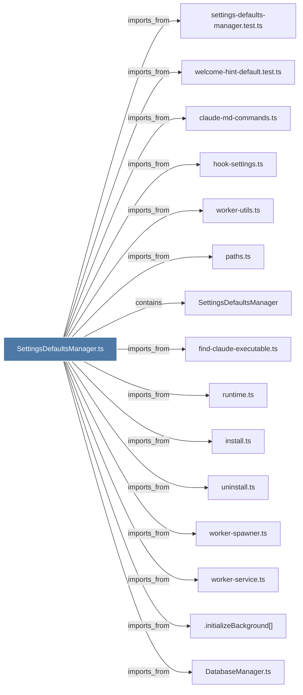

# SettingsDefaultsManager.ts

> [!info] Properties
> **File Type**: code
> **Community**: [[_COMMUNITY_Community None|Community None]]
> **Degree**: 33

## Architecture Graph


## Outbound Connections
- [[.initializeBackground()]] - `imports_from` [EXTRACTED]
- [[ChromaMcpManager.ts]] - `imports_from` [EXTRACTED]
- [[ChromaRoutes.ts]] - `imports_from` [EXTRACTED]
- [[ChromaSyncState.ts]] - `imports_from` [EXTRACTED]
- [[ClaudeProvider.ts]] - `imports_from` [EXTRACTED]
- [[ContextConfigLoader.ts]] - `imports_from` [EXTRACTED]
- [[DatabaseManager.ts]] - `imports_from` [EXTRACTED]
- [[GeminiProvider.ts]] - `imports_from` [EXTRACTED]
- [[KnowledgeAgent.ts]] - `imports_from` [EXTRACTED]
- [[LogsRoutes.ts]] - `imports_from` [EXTRACTED]
- [[OpenClawInstaller.ts]] - `imports_from` [EXTRACTED]
- [[OpenRouterProvider.ts]] - `imports_from` [EXTRACTED]
- [[ResponseProcessor.ts]] - `imports_from` [EXTRACTED]
- [[SearchRoutes.ts]] - `imports_from` [EXTRACTED]
- [[SessionRoutes.ts]] - `imports_from` [EXTRACTED]
- [[SettingsDefaultsManager]] - `contains` [EXTRACTED]
- [[SettingsRoutes.ts]] - `imports_from` [EXTRACTED]
- [[TelegramNotifier.ts]] - `imports_from` [EXTRACTED]
- [[claude-md-commands.ts]] - `imports_from` [EXTRACTED]
- [[claude-md-utils.ts]] - `imports_from` [EXTRACTED]
- [[find-claude-executable.ts]] - `imports_from` [EXTRACTED]
- [[hook-settings.ts]] - `imports_from` [EXTRACTED]
- [[install.ts]] - `imports_from` [EXTRACTED]
- [[paths.ts]] - `imports_from` [EXTRACTED]
- [[regenerate-claude-md.ts]] - `imports_from` [EXTRACTED]
- [[runtime.ts]] - `imports_from` [EXTRACTED]
- [[settings-defaults-manager.test.ts]] - `imports_from` [EXTRACTED]
- [[shared.ts]] - `imports_from` [EXTRACTED]
- [[uninstall.ts]] - `imports_from` [EXTRACTED]
- [[welcome-hint-default.test.ts]] - `imports_from` [EXTRACTED]
- [[worker-service.ts]] - `imports_from` [EXTRACTED]
- [[worker-spawner.ts]] - `imports_from` [EXTRACTED]
- [[worker-utils.ts]] - `imports_from` [EXTRACTED]

## Inbound Dependencies
> [!abstract]- Files that link here
```dataview
LIST
FROM [[SettingsDefaultsManager.ts]]
```

#graphify/code #graphify/EXTRACTED #community/Community_None