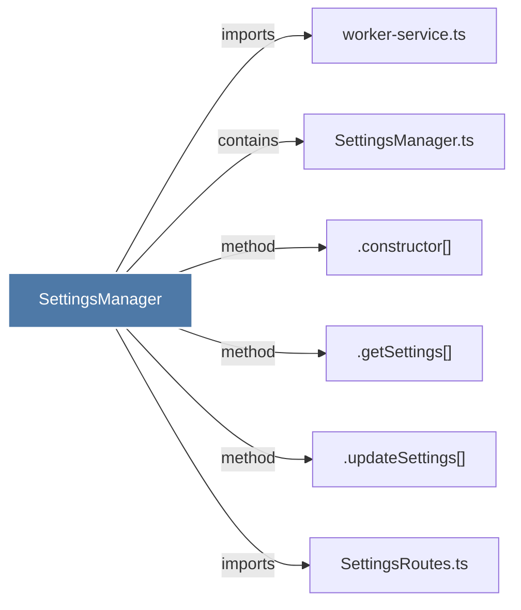

# SettingsManager

> [!info] Properties
> **File Type**: code
> **Community**: [[_COMMUNITY_Community None|Community None]]
> **Degree**: 6

## Architecture Graph


## Outbound Connections
- [[.constructor()_12]] - `method` [EXTRACTED]
- [[.getSettings()]] - `method` [EXTRACTED]
- [[.updateSettings()]] - `method` [EXTRACTED]
- [[SettingsManager.ts]] - `contains` [EXTRACTED]
- [[SettingsRoutes.ts]] - `imports` [EXTRACTED]
- [[worker-service.ts]] - `imports` [EXTRACTED]

## Inbound Dependencies
> [!abstract]- Files that link here
```dataview
LIST
FROM [[SettingsManager]]
```

#graphify/code #graphify/EXTRACTED #community/Community_None