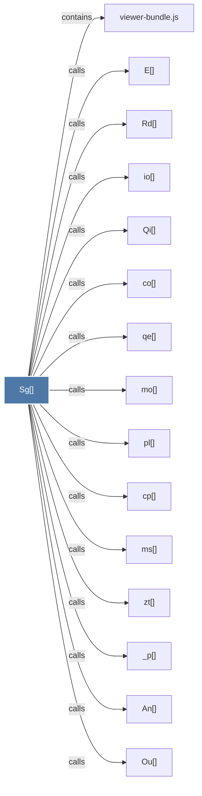

# Sg()

> [!info] Properties
> **File Type**: code
> **Community**: [[_COMMUNITY_Community None|Community None]]
> **Degree**: 51

## Architecture Graph


## Outbound Connections
- [[$v()]] - `calls` [EXTRACTED]
- [[An()]] - `calls` [EXTRACTED]
- [[Dn()]] - `calls` [EXTRACTED]
- [[Dr()]] - `calls` [EXTRACTED]
- [[E()]] - `calls` [EXTRACTED]
- [[Ho()]] - `calls` [EXTRACTED]
- [[Im()]] - `calls` [EXTRACTED]
- [[Mn()]] - `calls` [EXTRACTED]
- [[N()]] - `calls` [INFERRED]
- [[Ou()]] - `calls` [EXTRACTED]
- [[Pv()]] - `calls` [EXTRACTED]
- [[Qi()]] - `calls` [EXTRACTED]
- [[Rd()]] - `calls` [EXTRACTED]
- [[Tl()]] - `calls` [EXTRACTED]
- [[Ve()]] - `calls` [EXTRACTED]
- [[Ye()]] - `calls` [EXTRACTED]
- [[_o()]] - `calls` [EXTRACTED]
- [[_p()]] - `calls` [EXTRACTED]
- [[bi()]] - `calls` [EXTRACTED]
- [[bs()]] - `calls` [EXTRACTED]
- [[co()]] - `calls` [EXTRACTED]
- [[cp()]] - `calls` [EXTRACTED]
- [[du()]] - `calls` [EXTRACTED]
- [[dy()]] - `calls` [EXTRACTED]
- [[eg()]] - `calls` [EXTRACTED]
- [[gs()]] - `calls` [EXTRACTED]
- [[hg()]] - `calls` [EXTRACTED]
- [[hs()]] - `calls` [EXTRACTED]
- [[io()]] - `calls` [EXTRACTED]
- [[kg()]] - `calls` [EXTRACTED]
- [[ld()]] - `calls` [EXTRACTED]
- [[ln()]] - `calls` [EXTRACTED]
- [[md()]] - `calls` [EXTRACTED]
- [[mo()]] - `calls` [EXTRACTED]
- [[ms()]] - `calls` [EXTRACTED]
- [[ny()]] - `calls` [EXTRACTED]
- [[pl()]] - `calls` [EXTRACTED]
- [[pu()]] - `calls` [EXTRACTED]
- [[qe()]] - `calls` [EXTRACTED]
- [[qo()]] - `calls` [EXTRACTED]
- [[qt()]] - `calls` [EXTRACTED]
- [[s0()]] - `calls` [EXTRACTED]
- [[td()]] - `calls` [EXTRACTED]
- [[vg()]] - `calls` [EXTRACTED]
- [[viewer-bundle.js]] - `contains` [EXTRACTED]
- [[vn()]] - `calls` [EXTRACTED]
- [[wm()]] - `calls` [EXTRACTED]
- [[yg()]] - `calls` [EXTRACTED]
- [[ys()]] - `calls` [EXTRACTED]
- [[zl()]] - `calls` [EXTRACTED]
- [[zt()]] - `calls` [EXTRACTED]

## Inbound Dependencies
> [!abstract]- Files that link here
```dataview
LIST
FROM [[Sg()]]
```

#graphify/code #graphify/EXTRACTED #community/Community_None