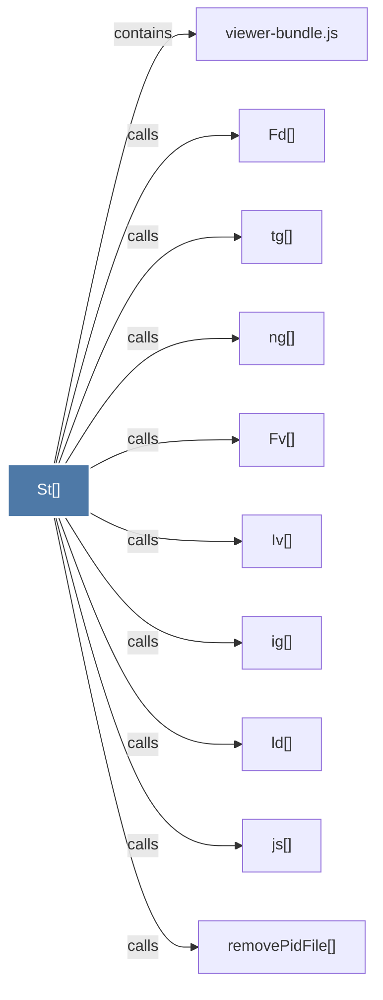

# St()

> [!info] Properties
> **File Type**: code
> **Community**: [[_COMMUNITY_Community None|Community None]]
> **Degree**: 10

## Architecture Graph


## Outbound Connections
- [[Fd()]] - `calls` [EXTRACTED]
- [[Fv()]] - `calls` [EXTRACTED]
- [[Iv()]] - `calls` [EXTRACTED]
- [[ig()]] - `calls` [EXTRACTED]
- [[js()]] - `calls` [EXTRACTED]
- [[ld()]] - `calls` [EXTRACTED]
- [[ng()]] - `calls` [EXTRACTED]
- [[removePidFile()_1]] - `calls` [INFERRED]
- [[tg()]] - `calls` [EXTRACTED]
- [[viewer-bundle.js]] - `contains` [EXTRACTED]

## Inbound Dependencies
> [!abstract]- Files that link here
```dataview
LIST
FROM [[St()]]
```

#graphify/code #graphify/EXTRACTED #community/Community_None