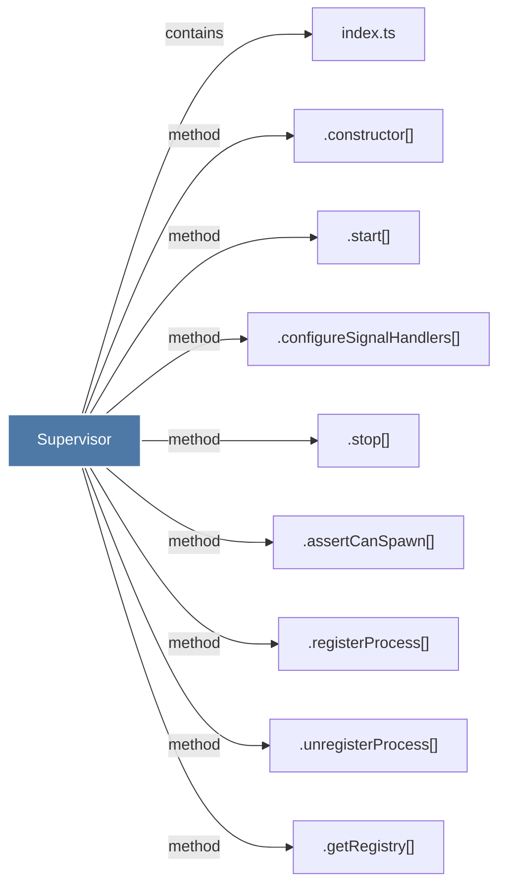

# Supervisor

> [!info] Properties
> **File Type**: code
> **Community**: [[_COMMUNITY_Community None|Community None]]
> **Degree**: 9

## Architecture Graph


## Outbound Connections
- [[.assertCanSpawn()]] - `method` [EXTRACTED]
- [[.configureSignalHandlers()]] - `method` [EXTRACTED]
- [[.constructor()_45]] - `method` [EXTRACTED]
- [[.getRegistry()]] - `method` [EXTRACTED]
- [[.registerProcess()]] - `method` [EXTRACTED]
- [[.start()_3]] - `method` [EXTRACTED]
- [[.stop()_2]] - `method` [EXTRACTED]
- [[.unregisterProcess()]] - `method` [EXTRACTED]
- [[index.ts_11]] - `contains` [EXTRACTED]

## Inbound Dependencies
> [!abstract]- Files that link here
```dataview
LIST
FROM [[Supervisor]]
```

#graphify/code #graphify/EXTRACTED #community/Community_None