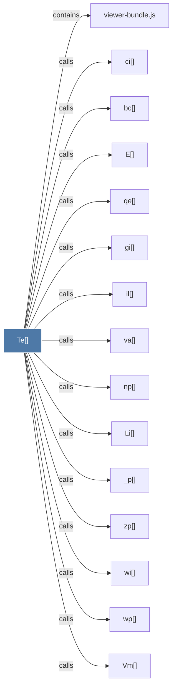

# Te()

> [!info] Properties
> **File Type**: code
> **Community**: [[_COMMUNITY_Community None|Community None]]
> **Degree**: 25

## Architecture Graph


## Outbound Connections
- [[Dr()]] - `calls` [EXTRACTED]
- [[E()]] - `calls` [EXTRACTED]
- [[Li()]] - `calls` [EXTRACTED]
- [[Pp()]] - `calls` [EXTRACTED]
- [[Qm()]] - `calls` [EXTRACTED]
- [[Vm()]] - `calls` [EXTRACTED]
- [[_p()]] - `calls` [EXTRACTED]
- [[ag()]] - `calls` [EXTRACTED]
- [[bE()]] - `calls` [EXTRACTED]
- [[bc()]] - `calls` [EXTRACTED]
- [[by()]] - `calls` [EXTRACTED]
- [[ci()]] - `calls` [EXTRACTED]
- [[gi()]] - `calls` [EXTRACTED]
- [[il()]] - `calls` [EXTRACTED]
- [[k()]] - `calls` [EXTRACTED]
- [[kp()]] - `calls` [EXTRACTED]
- [[np()]] - `calls` [EXTRACTED]
- [[qe()]] - `calls` [EXTRACTED]
- [[qp()]] - `calls` [EXTRACTED]
- [[ug()]] - `calls` [EXTRACTED]
- [[va()]] - `calls` [EXTRACTED]
- [[viewer-bundle.js]] - `contains` [EXTRACTED]
- [[wi()]] - `calls` [EXTRACTED]
- [[wp()]] - `calls` [EXTRACTED]
- [[zp()]] - `calls` [EXTRACTED]

## Inbound Dependencies
> [!abstract]- Files that link here
```dataview
LIST
FROM [[Te()]]
```

#graphify/code #graphify/EXTRACTED #community/Community_None