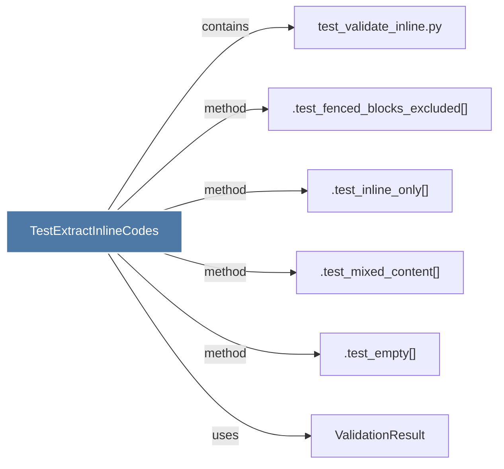

# TestExtractInlineCodes

> [!info] Properties
> **File Type**: code
> **Community**: [[_COMMUNITY_Community None|Community None]]
> **Degree**: 6

## Architecture Graph


## Outbound Connections
- [[.test_empty()]] - `method` [EXTRACTED]
- [[.test_fenced_blocks_excluded()]] - `method` [EXTRACTED]
- [[.test_inline_only()]] - `method` [EXTRACTED]
- [[.test_mixed_content()]] - `method` [EXTRACTED]
- [[ValidationResult]] - `uses` [INFERRED]
- [[test_validate_inline.py]] - `contains` [EXTRACTED]

## Inbound Dependencies
> [!abstract]- Files that link here
```dataview
LIST
FROM [[TestExtractInlineCodes]]
```

#graphify/code #graphify/EXTRACTED #community/Community_None