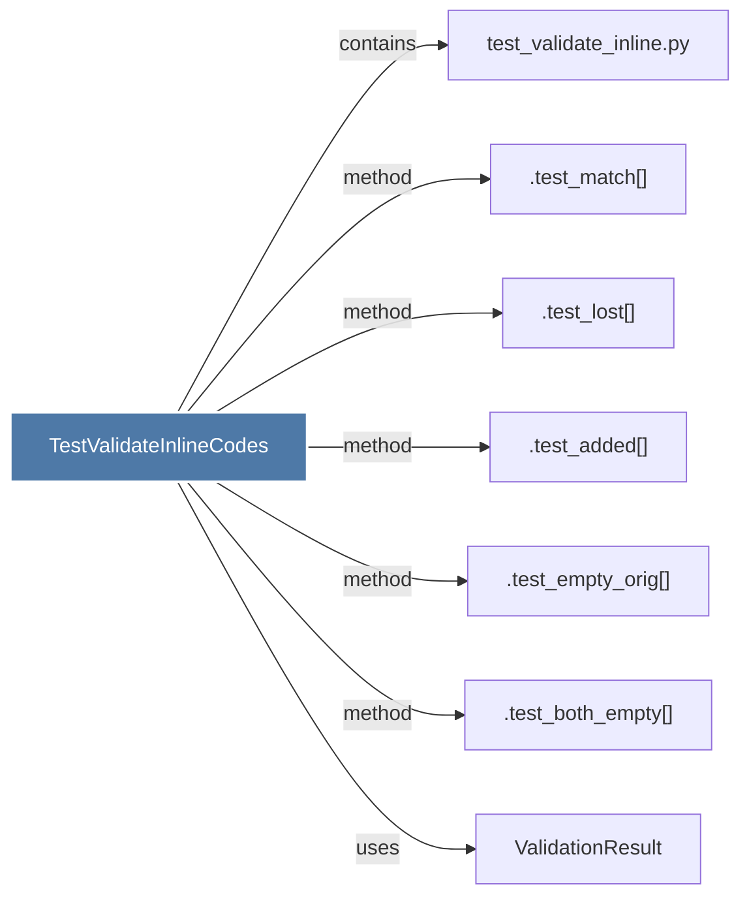

# TestValidateInlineCodes

> [!info] Properties
> **File Type**: code
> **Community**: [[_COMMUNITY_Community None|Community None]]
> **Degree**: 7

## Architecture Graph


## Outbound Connections
- [[.test_added()]] - `method` [EXTRACTED]
- [[.test_both_empty()]] - `method` [EXTRACTED]
- [[.test_empty_orig()]] - `method` [EXTRACTED]
- [[.test_lost()]] - `method` [EXTRACTED]
- [[.test_match()]] - `method` [EXTRACTED]
- [[ValidationResult]] - `uses` [INFERRED]
- [[test_validate_inline.py]] - `contains` [EXTRACTED]

## Inbound Dependencies
> [!abstract]- Files that link here
```dataview
LIST
FROM [[TestValidateInlineCodes]]
```

#graphify/code #graphify/EXTRACTED #community/Community_None