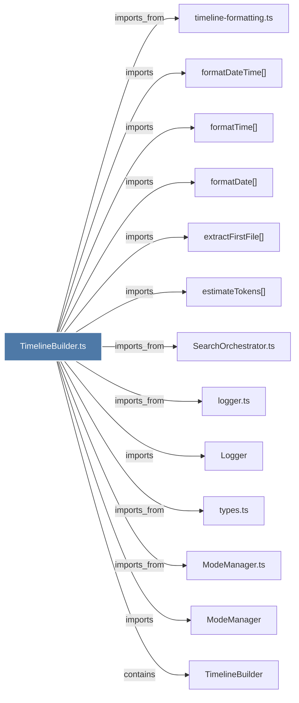

# TimelineBuilder.ts

> [!info] Properties
> **File Type**: code
> **Community**: [[_COMMUNITY_Community None|Community None]]
> **Degree**: 13

## Architecture Graph


## Outbound Connections
- [[Logger]] - `imports` [EXTRACTED]
- [[ModeManager]] - `imports` [EXTRACTED]
- [[ModeManager.ts]] - `imports_from` [EXTRACTED]
- [[SearchOrchestrator.ts]] - `imports_from` [EXTRACTED]
- [[TimelineBuilder]] - `contains` [EXTRACTED]
- [[estimateTokens()_1]] - `imports` [EXTRACTED]
- [[extractFirstFile()]] - `imports` [EXTRACTED]
- [[formatDate()_1]] - `imports` [EXTRACTED]
- [[formatDateTime()]] - `imports` [EXTRACTED]
- [[formatTime()_1]] - `imports` [EXTRACTED]
- [[logger.ts]] - `imports_from` [EXTRACTED]
- [[timeline-formatting.ts]] - `imports_from` [EXTRACTED]
- [[types.ts_2]] - `imports_from` [EXTRACTED]

## Inbound Dependencies
> [!abstract]- Files that link here
```dataview
LIST
FROM [[TimelineBuilder.ts]]
```

#graphify/code #graphify/EXTRACTED #community/Community_None