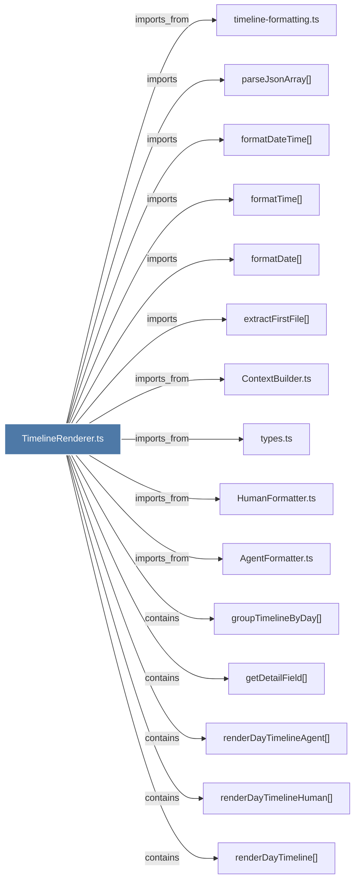

# TimelineRenderer.ts

> [!info] Properties
> **File Type**: code
> **Community**: [[_COMMUNITY_Community None|Community None]]
> **Degree**: 16

## Architecture Graph


## Outbound Connections
- [[AgentFormatter.ts]] - `imports_from` [EXTRACTED]
- [[ContextBuilder.ts]] - `imports_from` [EXTRACTED]
- [[HumanFormatter.ts]] - `imports_from` [EXTRACTED]
- [[extractFirstFile()]] - `imports` [EXTRACTED]
- [[formatDate()_1]] - `imports` [EXTRACTED]
- [[formatDateTime()]] - `imports` [EXTRACTED]
- [[formatTime()_1]] - `imports` [EXTRACTED]
- [[getDetailField()]] - `contains` [EXTRACTED]
- [[groupTimelineByDay()]] - `contains` [EXTRACTED]
- [[parseJsonArray()]] - `imports` [EXTRACTED]
- [[renderDayTimeline()]] - `contains` [EXTRACTED]
- [[renderDayTimelineAgent()]] - `contains` [EXTRACTED]
- [[renderDayTimelineHuman()]] - `contains` [EXTRACTED]
- [[renderTimeline()]] - `contains` [EXTRACTED]
- [[timeline-formatting.ts]] - `imports_from` [EXTRACTED]
- [[types.ts_12]] - `imports_from` [EXTRACTED]

## Inbound Dependencies
> [!abstract]- Files that link here
```dataview
LIST
FROM [[TimelineRenderer.ts]]
```

#graphify/code #graphify/EXTRACTED #community/Community_None