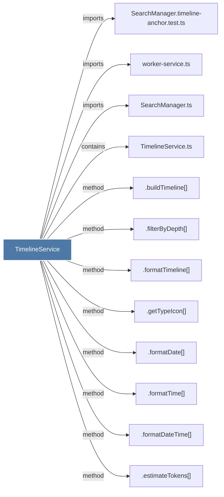

# TimelineService

> [!info] Properties
> **File Type**: code
> **Community**: [[_COMMUNITY_Community None|Community None]]
> **Degree**: 12

## Architecture Graph


## Outbound Connections
- [[.buildTimeline()]] - `method` [EXTRACTED]
- [[.estimateTokens()_1]] - `method` [EXTRACTED]
- [[.filterByDepth()]] - `method` [EXTRACTED]
- [[.formatDate()]] - `method` [EXTRACTED]
- [[.formatDateTime()]] - `method` [EXTRACTED]
- [[.formatTime()_1]] - `method` [EXTRACTED]
- [[.formatTimeline()]] - `method` [EXTRACTED]
- [[.getTypeIcon()]] - `method` [EXTRACTED]
- [[SearchManager.timeline-anchor.test.ts]] - `imports` [EXTRACTED]
- [[SearchManager.ts]] - `imports` [EXTRACTED]
- [[TimelineService.ts]] - `contains` [EXTRACTED]
- [[worker-service.ts]] - `imports` [EXTRACTED]

## Inbound Dependencies
> [!abstract]- Files that link here
```dataview
LIST
FROM [[TimelineService]]
```

#graphify/code #graphify/EXTRACTED #community/Community_None