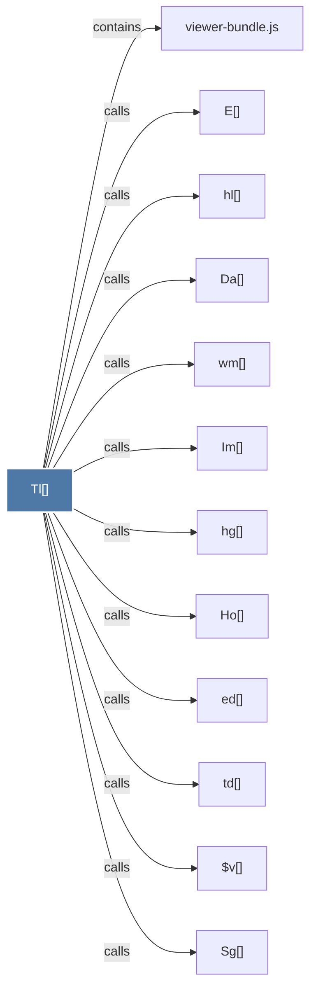

# Tl()

> [!info] Properties
> **File Type**: code
> **Community**: [[_COMMUNITY_Community None|Community None]]
> **Degree**: 12

## Architecture Graph


## Outbound Connections
- [[$v()]] - `calls` [EXTRACTED]
- [[Da()]] - `calls` [EXTRACTED]
- [[E()]] - `calls` [EXTRACTED]
- [[Ho()]] - `calls` [EXTRACTED]
- [[Im()]] - `calls` [EXTRACTED]
- [[Sg()]] - `calls` [EXTRACTED]
- [[ed()]] - `calls` [EXTRACTED]
- [[hg()]] - `calls` [EXTRACTED]
- [[hl()]] - `calls` [EXTRACTED]
- [[td()]] - `calls` [EXTRACTED]
- [[viewer-bundle.js]] - `contains` [EXTRACTED]
- [[wm()]] - `calls` [EXTRACTED]

## Inbound Dependencies
> [!abstract]- Files that link here
```dataview
LIST
FROM [[Tl()]]
```

#graphify/code #graphify/EXTRACTED #community/Community_None