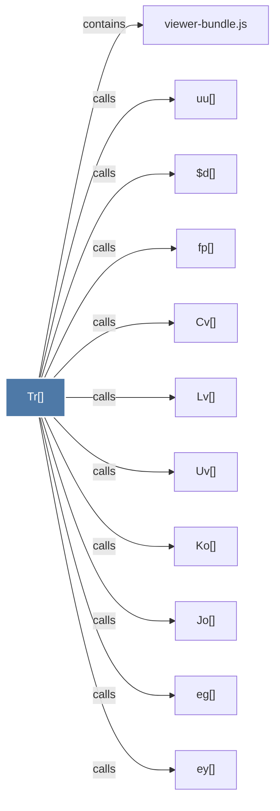

# Tr()

> [!info] Properties
> **File Type**: code
> **Community**: [[_COMMUNITY_Community None|Community None]]
> **Degree**: 11

## Architecture Graph


## Outbound Connections
- [[$d()]] - `calls` [EXTRACTED]
- [[Cv()]] - `calls` [EXTRACTED]
- [[Jo()]] - `calls` [EXTRACTED]
- [[Ko()]] - `calls` [EXTRACTED]
- [[Lv()]] - `calls` [EXTRACTED]
- [[Uv()]] - `calls` [EXTRACTED]
- [[eg()]] - `calls` [EXTRACTED]
- [[ey()]] - `calls` [EXTRACTED]
- [[fp()]] - `calls` [EXTRACTED]
- [[uu()]] - `calls` [EXTRACTED]
- [[viewer-bundle.js]] - `contains` [EXTRACTED]

## Inbound Dependencies
> [!abstract]- Files that link here
```dataview
LIST
FROM [[Tr()]]
```

#graphify/code #graphify/EXTRACTED #community/Community_None