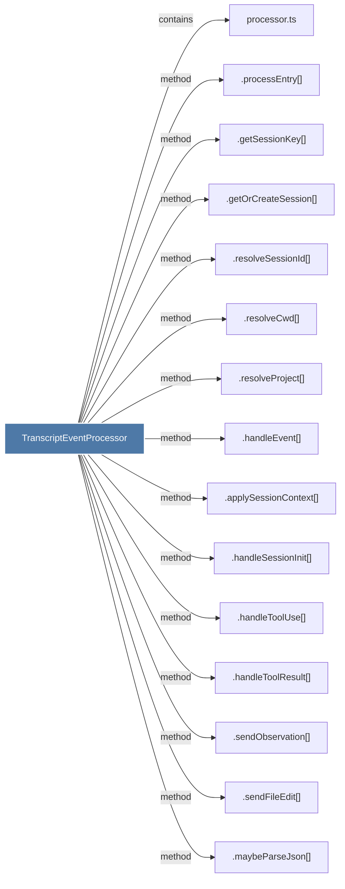

# TranscriptEventProcessor

> [!info] Properties
> **File Type**: code
> **Community**: [[_COMMUNITY_Community None|Community None]]
> **Degree**: 20

## Architecture Graph


## Outbound Connections
- [[.applySessionContext()]] - `method` [EXTRACTED]
- [[.getOrCreateSession()]] - `method` [EXTRACTED]
- [[.getSessionKey()]] - `method` [EXTRACTED]
- [[.handleEvent()]] - `method` [EXTRACTED]
- [[.handleSessionEnd()]] - `method` [EXTRACTED]
- [[.handleSessionInit()]] - `method` [EXTRACTED]
- [[.handleToolResult()]] - `method` [EXTRACTED]
- [[.handleToolUse()]] - `method` [EXTRACTED]
- [[.maybeParseJson()]] - `method` [EXTRACTED]
- [[.parseApplyPatchFiles()]] - `method` [EXTRACTED]
- [[.processEntry()]] - `method` [EXTRACTED]
- [[.queueSummary()]] - `method` [EXTRACTED]
- [[.resolveCwd()]] - `method` [EXTRACTED]
- [[.resolveProject()]] - `method` [EXTRACTED]
- [[.resolveSessionId()]] - `method` [EXTRACTED]
- [[.sendFileEdit()]] - `method` [EXTRACTED]
- [[.sendObservation()]] - `method` [EXTRACTED]
- [[.updateContext()]] - `method` [EXTRACTED]
- [[processor.ts]] - `contains` [EXTRACTED]
- [[watcher.ts]] - `imports` [EXTRACTED]

## Inbound Dependencies
> [!abstract]- Files that link here
```dataview
LIST
FROM [[TranscriptEventProcessor]]
```

#graphify/code #graphify/EXTRACTED #community/Community_None