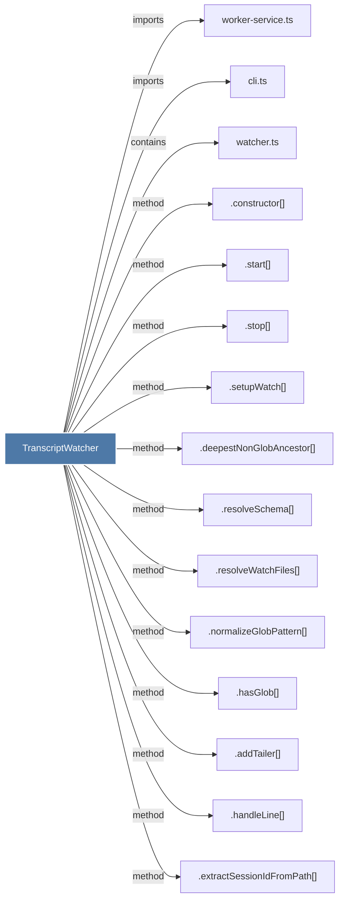

# TranscriptWatcher

> [!info] Properties
> **File Type**: code
> **Community**: [[_COMMUNITY_Community None|Community None]]
> **Degree**: 15

## Architecture Graph


## Outbound Connections
- [[.addTailer()]] - `method` [EXTRACTED]
- [[.constructor()_33]] - `method` [EXTRACTED]
- [[.deepestNonGlobAncestor()]] - `method` [EXTRACTED]
- [[.extractSessionIdFromPath()]] - `method` [EXTRACTED]
- [[.handleLine()]] - `method` [EXTRACTED]
- [[.hasGlob()]] - `method` [EXTRACTED]
- [[.normalizeGlobPattern()]] - `method` [EXTRACTED]
- [[.resolveSchema()]] - `method` [EXTRACTED]
- [[.resolveWatchFiles()]] - `method` [EXTRACTED]
- [[.setupWatch()]] - `method` [EXTRACTED]
- [[.start()_2]] - `method` [EXTRACTED]
- [[.stop()]] - `method` [EXTRACTED]
- [[cli.ts]] - `imports` [EXTRACTED]
- [[watcher.ts]] - `contains` [EXTRACTED]
- [[worker-service.ts]] - `imports` [EXTRACTED]

## Inbound Dependencies
> [!abstract]- Files that link here
```dataview
LIST
FROM [[TranscriptWatcher]]
```

#graphify/code #graphify/EXTRACTED #community/Community_None