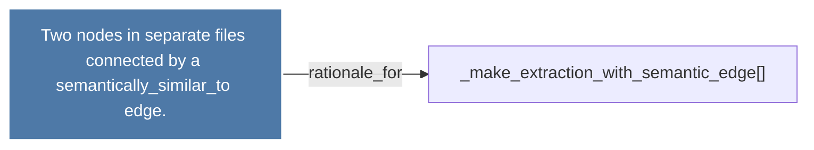

# Two nodes in separate files connected by a semantically_similar_to edge.

> [!info] Properties
> **File Type**: rationale
> **Community**: [[_COMMUNITY_Community None|Community None]]
> **Degree**: 1

## Architecture Graph


## Outbound Connections
- [[_make_extraction_with_semantic_edge()]] - `rationale_for` [EXTRACTED]

## Inbound Dependencies
> [!abstract]- Files that link here
```dataview
LIST
FROM [[Two nodes in separate files connected by a semantically_similar_to edge.]]
```

#graphify/rationale #graphify/EXTRACTED #community/Community_None