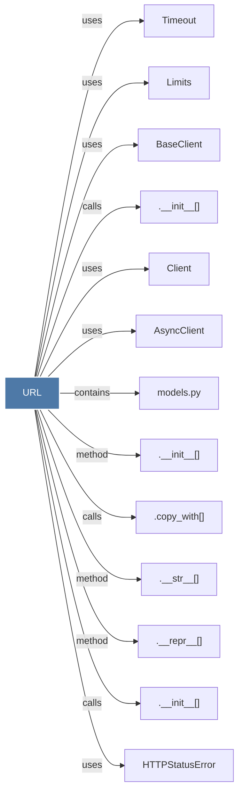

# URL

> [!info] Properties
> **File Type**: code
> **Community**: [[_COMMUNITY_Community None|Community None]]
> **Degree**: 13

## Architecture Graph


## Outbound Connections
- [[.__init__()_12]] - `calls` [INFERRED]
- [[.__init__()_15]] - `method` [EXTRACTED]
- [[.__init__()_18]] - `calls` [EXTRACTED]
- [[.__repr__()]] - `method` [EXTRACTED]
- [[.__str__()]] - `method` [EXTRACTED]
- [[.copy_with()]] - `calls` [EXTRACTED]
- [[AsyncClient]] - `uses` [INFERRED]
- [[BaseClient]] - `uses` [INFERRED]
- [[Client]] - `uses` [INFERRED]
- [[HTTPStatusError]] - `uses` [INFERRED]
- [[Limits]] - `uses` [INFERRED]
- [[Timeout]] - `uses` [INFERRED]
- [[models.py]] - `contains` [EXTRACTED]

## Inbound Dependencies
> [!abstract]- Files that link here
```dataview
LIST
FROM [[URL]]
```

#graphify/code #graphify/INFERRED #community/Community_None