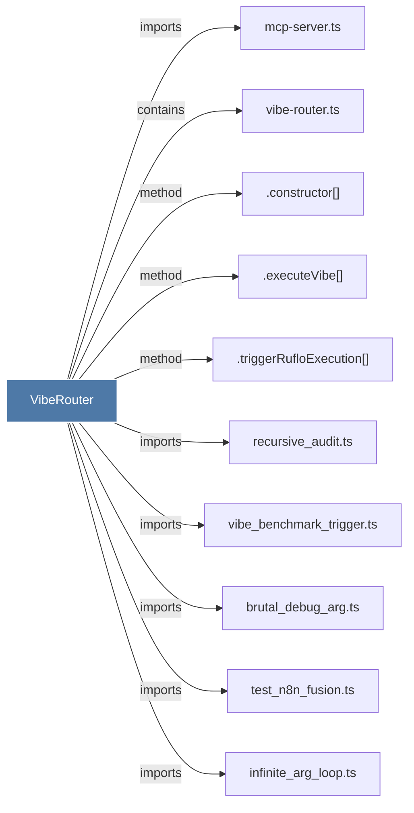

# VibeRouter

> [!info] Properties
> **File Type**: code
> **Community**: [[_COMMUNITY_Community None|Community None]]
> **Degree**: 10

## Architecture Graph


## Outbound Connections
- [[.constructor()_51]] - `method` [EXTRACTED]
- [[.executeVibe()]] - `method` [EXTRACTED]
- [[.triggerRufloExecution()]] - `method` [EXTRACTED]
- [[brutal_debug_arg.ts]] - `imports` [EXTRACTED]
- [[infinite_arg_loop.ts]] - `imports` [EXTRACTED]
- [[mcp-server.ts_1]] - `imports` [EXTRACTED]
- [[recursive_audit.ts]] - `imports` [EXTRACTED]
- [[test_n8n_fusion.ts]] - `imports` [EXTRACTED]
- [[vibe-router.ts]] - `contains` [EXTRACTED]
- [[vibe_benchmark_trigger.ts]] - `imports` [EXTRACTED]

## Inbound Dependencies
> [!abstract]- Files that link here
```dataview
LIST
FROM [[VibeRouter]]
```

#graphify/code #graphify/EXTRACTED #community/Community_None