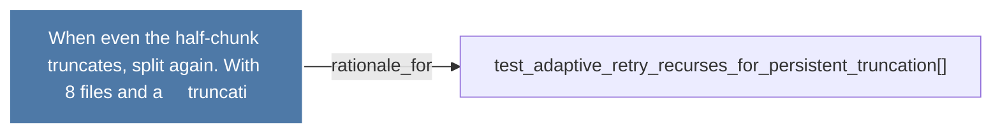

# When even the half-chunk truncates, split again. With 8 files and a     truncati

> [!info] Properties
> **File Type**: rationale
> **Community**: [[_COMMUNITY_Community None|Community None]]
> **Degree**: 1

## Architecture Graph


## Outbound Connections
- [[test_adaptive_retry_recurses_for_persistent_truncation()]] - `rationale_for` [EXTRACTED]

## Inbound Dependencies
> [!abstract]- Files that link here
```dataview
LIST
FROM [[When even the half-chunk truncates, split again. With 8 files and a     truncati]]
```

#graphify/rationale #graphify/EXTRACTED #community/Community_None