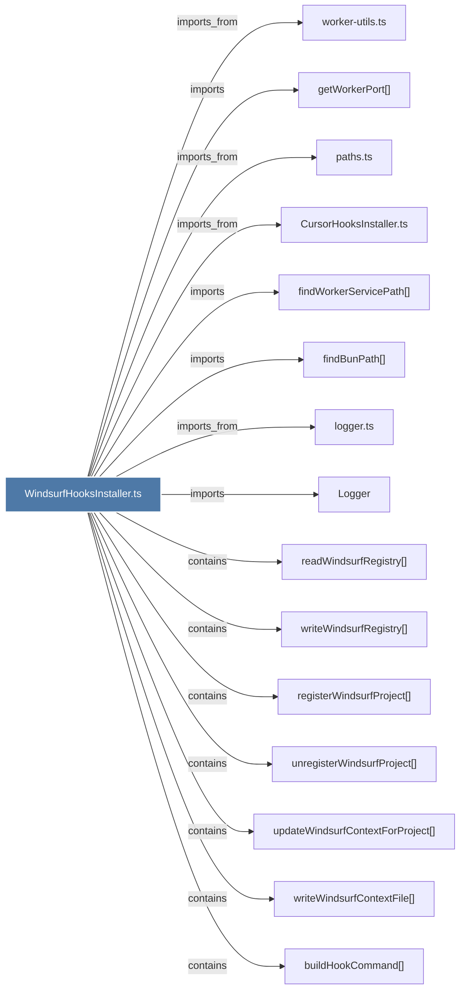

# WindsurfHooksInstaller.ts

> [!info] Properties
> **File Type**: code
> **Community**: [[_COMMUNITY_Community None|Community None]]
> **Degree**: 25

## Architecture Graph


## Outbound Connections
- [[CursorHooksInstaller.ts]] - `imports_from` [EXTRACTED]
- [[Logger]] - `imports` [EXTRACTED]
- [[buildHookCommand()]] - `contains` [EXTRACTED]
- [[checkWindsurfHooksStatus()]] - `contains` [EXTRACTED]
- [[fetchWindsurfContextFromWorker()]] - `contains` [EXTRACTED]
- [[findBunPath()]] - `imports` [EXTRACTED]
- [[findWorkerServicePath()]] - `imports` [EXTRACTED]
- [[getWorkerPort()]] - `imports` [EXTRACTED]
- [[handleWindsurfCommand()]] - `contains` [EXTRACTED]
- [[installWindsurfHooks()]] - `contains` [EXTRACTED]
- [[logger.ts]] - `imports_from` [EXTRACTED]
- [[mergeAndWriteHooksJson()]] - `contains` [EXTRACTED]
- [[paths.ts]] - `imports_from` [EXTRACTED]
- [[readWindsurfRegistry()]] - `contains` [EXTRACTED]
- [[registerWindsurfProject()]] - `contains` [EXTRACTED]
- [[removeClaudeMemHookEntries()]] - `contains` [EXTRACTED]
- [[removeWindsurfContextAndUnregister()]] - `contains` [EXTRACTED]
- [[setupWindsurfProjectContext()]] - `contains` [EXTRACTED]
- [[uninstallWindsurfHooks()]] - `contains` [EXTRACTED]
- [[unregisterWindsurfProject()]] - `contains` [EXTRACTED]
- [[updateWindsurfContextForProject()]] - `contains` [EXTRACTED]
- [[worker-utils.ts]] - `imports_from` [EXTRACTED]
- [[writeWindsurfContextFile()]] - `contains` [EXTRACTED]
- [[writeWindsurfHooksAndSetupContext()]] - `contains` [EXTRACTED]
- [[writeWindsurfRegistry()]] - `contains` [EXTRACTED]

## Inbound Dependencies
> [!abstract]- Files that link here
```dataview
LIST
FROM [[WindsurfHooksInstaller.ts]]
```

#graphify/code #graphify/EXTRACTED #community/Community_None