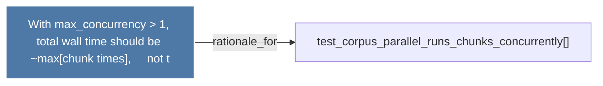

# With max_concurrency > 1, total wall time should be ~max(chunk times),     not t

> [!info] Properties
> **File Type**: rationale
> **Community**: [[_COMMUNITY_Community None|Community None]]
> **Degree**: 1

## Architecture Graph


## Outbound Connections
- [[test_corpus_parallel_runs_chunks_concurrently()]] - `rationale_for` [EXTRACTED]

## Inbound Dependencies
> [!abstract]- Files that link here
```dataview
LIST
FROM [[With max_concurrency  1, total wall time should be ~max(chunk times),     not t]]
```

#graphify/rationale #graphify/EXTRACTED #community/Community_None