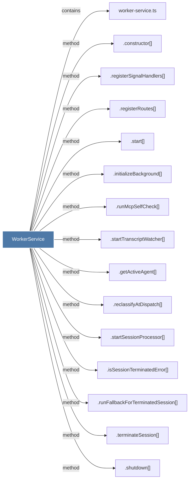

# WorkerService

> [!info] Properties
> **File Type**: code
> **Community**: [[_COMMUNITY_Community None|Community None]]
> **Degree**: 19

## Architecture Graph


## Outbound Connections
- [[.broadcastProcessingStatus()]] - `method` [EXTRACTED]
- [[.constructor()_4]] - `method` [EXTRACTED]
- [[.getActiveAgent()]] - `method` [EXTRACTED]
- [[.initializeBackground()]] - `method` [EXTRACTED]
- [[.isSessionTerminatedError()]] - `method` [EXTRACTED]
- [[.reclassifyAtDispatch()]] - `method` [EXTRACTED]
- [[.registerRoutes()]] - `method` [EXTRACTED]
- [[.registerSignalHandlers()]] - `method` [EXTRACTED]
- [[.runFallbackForTerminatedSession()]] - `method` [EXTRACTED]
- [[.runMcpSelfCheck()]] - `method` [EXTRACTED]
- [[.shutdown()]] - `method` [EXTRACTED]
- [[.start()]] - `method` [EXTRACTED]
- [[.startSessionProcessor()]] - `method` [EXTRACTED]
- [[.startTranscriptWatcher()]] - `method` [EXTRACTED]
- [[.terminateSession()]] - `method` [EXTRACTED]
- [[DataRoutes.ts]] - `imports` [EXTRACTED]
- [[SessionEventBroadcaster.ts]] - `imports` [EXTRACTED]
- [[SessionRoutes.ts]] - `imports` [EXTRACTED]
- [[worker-service.ts]] - `contains` [EXTRACTED]

## Inbound Dependencies
> [!abstract]- Files that link here
```dataview
LIST
FROM [[WorkerService]]
```

#graphify/code #graphify/EXTRACTED #community/Community_None