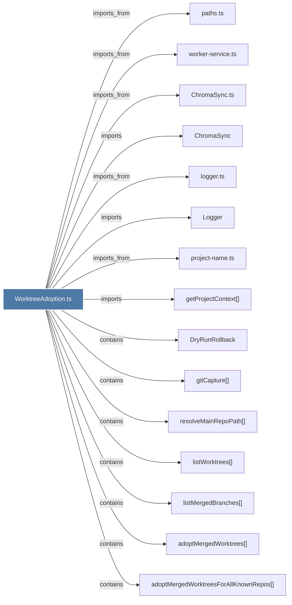

# WorktreeAdoption.ts

> [!info] Properties
> **File Type**: code
> **Community**: [[_COMMUNITY_Community None|Community None]]
> **Degree**: 15

## Architecture Graph


## Outbound Connections
- [[ChromaSync]] - `imports` [EXTRACTED]
- [[ChromaSync.ts]] - `imports_from` [EXTRACTED]
- [[DryRunRollback]] - `contains` [EXTRACTED]
- [[Logger]] - `imports` [EXTRACTED]
- [[adoptMergedWorktrees()]] - `contains` [EXTRACTED]
- [[adoptMergedWorktreesForAllKnownRepos()]] - `contains` [EXTRACTED]
- [[getProjectContext()]] - `imports` [EXTRACTED]
- [[gitCapture()]] - `contains` [EXTRACTED]
- [[listMergedBranches()]] - `contains` [EXTRACTED]
- [[listWorktrees()]] - `contains` [EXTRACTED]
- [[logger.ts]] - `imports_from` [EXTRACTED]
- [[paths.ts]] - `imports_from` [EXTRACTED]
- [[project-name.ts]] - `imports_from` [EXTRACTED]
- [[resolveMainRepoPath()]] - `contains` [EXTRACTED]
- [[worker-service.ts]] - `imports_from` [EXTRACTED]

## Inbound Dependencies
> [!abstract]- Files that link here
```dataview
LIST
FROM [[WorktreeAdoption.ts]]
```

#graphify/code #graphify/EXTRACTED #community/Community_None