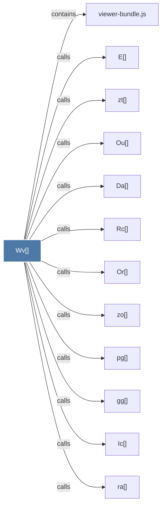

# Wv()

> [!info] Properties
> **File Type**: code
> **Community**: [[_COMMUNITY_Community None|Community None]]
> **Degree**: 12

## Architecture Graph


## Outbound Connections
- [[Da()]] - `calls` [EXTRACTED]
- [[E()]] - `calls` [EXTRACTED]
- [[Ic()]] - `calls` [EXTRACTED]
- [[Or()]] - `calls` [EXTRACTED]
- [[Ou()]] - `calls` [EXTRACTED]
- [[Rc()]] - `calls` [EXTRACTED]
- [[gg()]] - `calls` [EXTRACTED]
- [[pg()]] - `calls` [EXTRACTED]
- [[ra()]] - `calls` [EXTRACTED]
- [[viewer-bundle.js]] - `contains` [EXTRACTED]
- [[zo()]] - `calls` [EXTRACTED]
- [[zt()]] - `calls` [EXTRACTED]

## Inbound Dependencies
> [!abstract]- Files that link here
```dataview
LIST
FROM [[Wv()]]
```

#graphify/code #graphify/EXTRACTED #community/Community_None