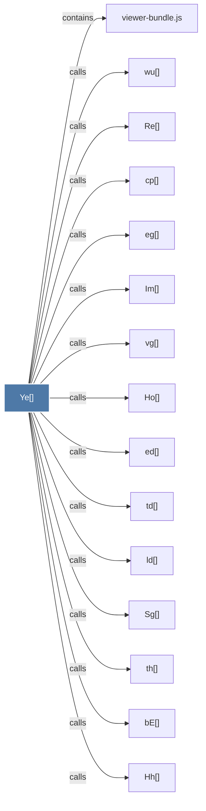

# Ye()

> [!info] Properties
> **File Type**: code
> **Community**: [[_COMMUNITY_Community None|Community None]]
> **Degree**: 18

## Architecture Graph


## Outbound Connections
- [[Hh()]] - `calls` [EXTRACTED]
- [[Ho()]] - `calls` [EXTRACTED]
- [[Im()]] - `calls` [EXTRACTED]
- [[Nh()]] - `calls` [EXTRACTED]
- [[Re()]] - `calls` [EXTRACTED]
- [[Sg()]] - `calls` [EXTRACTED]
- [[Vh()]] - `calls` [EXTRACTED]
- [[bE()]] - `calls` [EXTRACTED]
- [[cp()]] - `calls` [EXTRACTED]
- [[ed()]] - `calls` [EXTRACTED]
- [[eg()]] - `calls` [EXTRACTED]
- [[ld()]] - `calls` [EXTRACTED]
- [[qa()]] - `calls` [EXTRACTED]
- [[td()]] - `calls` [EXTRACTED]
- [[th()]] - `calls` [EXTRACTED]
- [[vg()]] - `calls` [EXTRACTED]
- [[viewer-bundle.js]] - `contains` [EXTRACTED]
- [[wu()]] - `calls` [EXTRACTED]

## Inbound Dependencies
> [!abstract]- Files that link here
```dataview
LIST
FROM [[Ye()]]
```

#graphify/code #graphify/EXTRACTED #community/Community_None