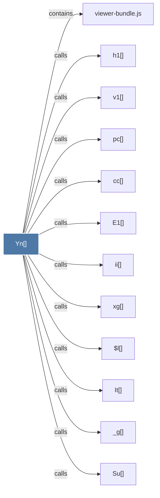

# Yn()

> [!info] Properties
> **File Type**: code
> **Community**: [[_COMMUNITY_Community None|Community None]]
> **Degree**: 12

## Architecture Graph


## Outbound Connections
- [[$l()]] - `calls` [EXTRACTED]
- [[E1()]] - `calls` [EXTRACTED]
- [[It()]] - `calls` [EXTRACTED]
- [[Su()]] - `calls` [EXTRACTED]
- [[_g()]] - `calls` [EXTRACTED]
- [[cc()]] - `calls` [EXTRACTED]
- [[h1()]] - `calls` [EXTRACTED]
- [[ii()]] - `calls` [EXTRACTED]
- [[pc()]] - `calls` [EXTRACTED]
- [[v1()]] - `calls` [EXTRACTED]
- [[viewer-bundle.js]] - `contains` [EXTRACTED]
- [[xg()]] - `calls` [EXTRACTED]

## Inbound Dependencies
> [!abstract]- Files that link here
```dataview
LIST
FROM [[Yn()]]
```

#graphify/code #graphify/EXTRACTED #community/Community_None